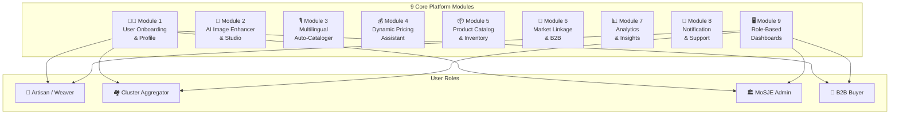
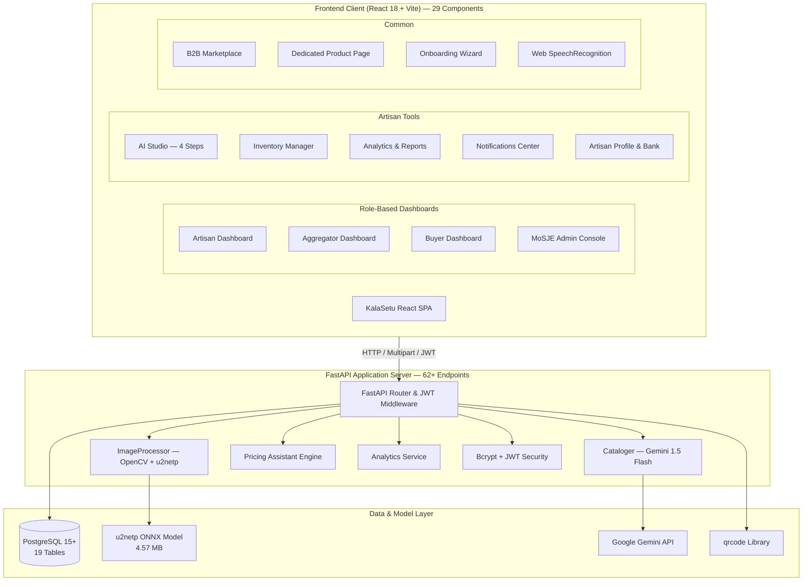

# 🎨 KalaSetu (Artisan AI) | कला सेतु

> **AI-Driven Market Linkage, Smart Multilingual Cataloging, and Governance Platform for Marginalized Artisans, Weavers & Micro-Entrepreneurs**  
> *Under the mandate of the Ministry of Social Justice and Empowerment (MoSJE) | Smart India Hackathon (SIH26090)*

---

<div align="center">


-005CED.svg?style=flat&logo=onnx&logoColor=white)


</div>

---

## 📌 Table of Contents

1. [Problem Statement & Background](#-problem-statement--background)
2. [Platform Architecture & 9-Module System](#-platform-architecture--9-module-system)
3. [User Roles & Role-Based Dashboards](#-user-roles--role-based-dashboards)
   - [Artisan Capability Suite](#-artisan-capability-suite)
   - [Cluster Aggregator Capability Suite](#-cluster-aggregator-capability-suite)
   - [B2B Buyer Capability Suite](#-b2b-buyer-capability-suite)
   - [MoSJE Admin Governance Console](#-mosje-governance-console-7-pillars)
4. [Module Deep-Dives](#️-module-deep-dives)
   - [Module 1 — User Onboarding & Profile Management](#module-1--user-onboarding--profile-management)
   - [Module 2 — AI Image Enhancer & Studio](#module-2--ai-image-enhancer--studio)
   - [Module 3 — Multilingual Auto-Cataloger](#module-3--multilingual-auto-cataloger)
   - [Module 4 — Dynamic Pricing Assistant](#module-4--dynamic-pricing-assistant)
   - [Module 5 — Product Catalog & Inventory Management](#module-5--product-catalog--inventory-management)
   - [Module 6 — Market Linkage & B2B Connection](#module-6--market-linkage--b2b-connection)
   - [Module 7 — Analytics & Insights](#module-7--analytics--insights)
   - [Module 8 — Notification & Support](#module-8--notification--support)
   - [Module 9 — Role-Based Dashboards](#module-9--role-based-dashboards)
5. [MoSJE Governance Console (7 Pillars)](#-mosje-governance-console-7-pillars)
6. [System Architecture & Data Flow](#-system-architecture--data-flow)
7. [Database Schema (Entity-Relationship)](#️-database-schema-entity-relationship)
8. [API Endpoint Reference (62+ Endpoints)](#-api-endpoint-reference-62-endpoints)
9. [Dynamic Pricing & Fair Wage Engine](#-dynamic-pricing--fair-wage-engine)
10. [Tech Stack](#️-tech-stack)
11. [Setup & Installation Guide](#-setup--installation-guide)
12. [How to Run](#-how-to-run)

---

## 📖 Problem Statement & Background

* **Problem Statement ID:** SIH26090
* **Theme:** Inclusive Socio-Economic Development & Direct Market Access
* **Target Beneficiaries:** Rural Artisans, Handloom Weavers, Pottery Masters, Tribal Craftsmen, and Micro-Enterprises.

### The Challenge

Government agencies regularly assist marginalized artisans by providing financial assistance, cluster development programs, and organizing traditional fairs (**Shilp Samagam**, **Surajkund Mela**, **Dilli Haat**). However, these events provide only temporary, intermittent sales windows. Once the fair concludes, artisans struggle to maintain digital continuity due to:

* **Digital & Technical Barriers:** Low digital literacy makes listing products on complex e-commerce platforms nearly impossible.
* **Photography & Visual Standards:** Inability to produce clean, studio-quality product photos in cluttered rural workshops.
* **Language & Content Barriers:** Difficulties formulating professional, SEO-optimized titles and descriptions in English and standard Hindi.
* **Pricing Vulnerability:** Exploitation by middlemen, lack of market visibility, and selling below living wage benchmarks.

### The Solution: KalaSetu

**KalaSetu (Artisan AI)** functions as an autonomous **Virtual Business Manager**. It empowers artisans to photograph a product, speak in their native tongue, receive instant pricing intelligence, and publish directly to a national B2B wholesale and D2C marketplace under verified government governance.

---

## 🧩 Platform Architecture & 9-Module System



---

## 👥 User Roles & Role-Based Dashboards

KalaSetu implements **full role-based routing** — each role sees a completely tailored experience:

| Role | Default View | Accessible Modules |
|:---|:---|:---|
| **Artisan / Weaver** | Artisan Dashboard | Dashboard · AI Studio · Inventory · Analytics · Inquiries & Alerts · Profile · Marketplace |
| **Cluster Aggregator** | Aggregator Dashboard | Cluster Management · Assisted Onboarding · Scheme Relay · MoSJE Reporting · Marketplace |
| **B2B Buyer** | Buyer Dashboard | Sent Inquiries & Order History · Browse Catalog · Matched Artisans · Verified Buyer Badge |
| **MoSJE Admin** | Admin Console | Full Governance Console (7 Pillars: Verifications, Clusters, Schemes, Fairs, Moderation, Buyers, Analytics) |
| **Unauthenticated** | Marketplace | Multi-Criteria Catalog Discovery (Read-Only & Guest Inquiries) |

---

### 🎨 Artisan Capability Suite

1. **Profile, Identity & Bank Details Management**:
   - Register profile with craft specialization (*Textiles & Handloom, Clay & Blue Pottery, Tribal & Silver Jewelry, Folk Paintings, Wood Inlay, Metalcraft*), geographic region, and assigned cooperative cluster.
   - Capture Aadhaar identification with official MoSJE verification badge tracking.
   - Maintain and update direct settlement details: **Bank Account Number**, **IFSC Code**, and **UPI ID** for DBT payouts (`GET /artisan/profile` & `PUT /artisan/profile`).
2. **National Government Exhibition & Mela Registration**:
   - Discover scheduled national fairs (**Shilp Samagam**, **Dilli Haat**, **Surajkund International Crafts Mela**, **Gandhi Shilp Bazar**).
   - 1-click **Register Stall** workflow directly from the dashboard (`POST /admin/exhibitions/{id}/register`).
3. **Inquiries, Scheme Alerts & Real-Time Messaging**:
   - Dedicated **Inquiries & Alerts** hub (`NotificationsCenter.jsx`) to receive wholesale quotation requests from enterprise buyers.
   - Interactive in-app direct reply to quote pricing, production lead times, and customization options (`POST /inquiries/{id}/respond`).
   - Receive broadcasted MoSJE welfare schemes, subsidized credit alerts, and exhibition stall confirmations.
4. **Simple, Visual & Bilingual Income Analytics**:
   - Clean, icon-based metric cards and horizontal bar tracks for catalog views, bulk inquiry volume, active listings, and estimated income (*दृश्य, पूछताछ, अनुमानित आय*).
   - 1-click downloadable CSV Sales & Performance Reports (`GET /artisan/report`).
5. **Digital Product Catalogue & Inventory Management**:
   - 4-step AI Studio product creation with auto-prefill from pricing engine.
   - Live inline price editing, B2B wholesale calculation, stock incrementer ($+/-$), status toggling (`Active`, `Draft`, `Sold Out`), downloadable catalog QR codes (`GET /products/{id}/qr`), and soft-archiving.

---

### 🤝 Cluster Aggregator Capability Suite

1. **Cluster Overview & Artisan Management**:
   - View, search, and manage all artisans registered under their regional handicraft cluster with direct contact info, craft type, and MoSJE verification status.
   - Export full cluster rosters to CSV (`GET /aggregator/artisans`).
2. **Assisted Onboarding for Low-Literacy Artisans**:
   - Register rural artisans directly in the field with name, phone, language preference (*Hindi, Bengali, Gujarati, Tamil, Odia, English*), and craft type.
   - Automatically assigns the artisan to the cluster and initiates the MoSJE verification queue (`POST /aggregator/artisans/onboard`).
3. **Catalogue Completion Status Monitoring**:
   - Color-coded tracking to monitor who has digitized products: `✅ Active Listings (3+ items)`, `⏳ Started (1-2 items)`, and `⚠️ 0 Listings (Unlisted)`.
4. **Photography & Voice Cataloging Support Flagging**:
   - Automatically flags unlisted or struggling members as **"Needs Photography / Voice Help"**.
   - Filterable view to plan studio photography camps and voice-assisted cataloging sessions.
5. **Cluster-Level Analytics & Inquiry Volumes**:
   - Real-time cluster metrics tracking total active listings, buyer inquiry count per member, and active handicraft specializations (`GET /aggregator/dashboard`).
6. **Receive & Relay Government Scheme Alerts**:
   - Broadcast official MoSJE welfare schemes, working capital subsidies, toolkits, and exhibition opportunities directly to cluster members via in-app alerts and SMS (`POST /aggregator/schemes/relay`).
7. **Submit Cluster-Level Reports to MoSJE Admin**:
   - Formally transmit monthly digitization milestones, welfare progress, and field notes directly to Ministry Administrators with automated audit trail logging (`POST /aggregator/reports/submit`).

---

### 🛍️ B2B Buyer Capability Suite

1. **Multi-Criteria Discovery & Advanced Filtering**:
   - Filter the national artisan catalogue by:
     - **Craft Category**: *Textiles & Handloom, Clay & Blue Pottery, Tribal & Silver Jewelry, Folk Paintings & Art, Wood Inlay & Carving, Handicrafts & Decor*.
     - **Region / State**: *Uttar Pradesh, Rajasthan, Gujarat, West Bengal, Odisha, Jammu & Kashmir, Madhya Pradesh, Karnataka, Tamil Nadu, Assam*.
     - **Material**: *Silk, Cotton, Clay, Silver, Brass, Wood, Marble, Terracotta, Jute*.
     - **Price Range Brackets**: *Under ₹1,000, ₹1,000–₹5,000, ₹5,000–₹15,000, Above ₹15,000*.
     - **Instant Keyword Search**: Case-insensitive search across English and Hindi titles, descriptions, and materials.
2. **Professional Listings with AI Photography & SEO**:
   - High-resolution studio-centered product imagery with background removal and enhanced lighting.
   - Dynamic hashtags (`#HandmadeInIndia`, `#VocalForLocal`, `#MoSJEVerified`, `#Silk`, `#Terracotta`) and bilingual story descriptions.
3. **Direct B2B Quotations & Bulk Inquiries**:
   - Submit bulk inquiry drawer specifying quantity, business email, custom pattern/color requirements, and delivery deadlines (`POST /inquiries`).
4. **Verified Artisan Profiles & Cluster Transparency**:
   - Inspect artisan craft clusters, geographic origin, and government-verified badges on dedicated standalone product pages (`ProductPage.jsx`).
5. **Inquiry & Order History Tracking**:
   - Track sent inquiries with real-time status lifecycles (`Pending`, `Responded`, `Completed`) and artisan quotation responses on the **Buyer Dashboard** (`GET /buyer/dashboard`).
6. **Personalized Category-Based Artisan Matching**:
   - Machine learning matching engine recommending top master artisans and SHG cooperatives based on past procurement interests.
7. **MoSJE Verified Buyer Badge**:
   - Verified enterprise buyers receive a trusted **"MoSJE Verified Buyer"** badge after admin KYC review to prevent spam and foster trust.

---

## ⚙️ Module Deep-Dives

### Module 1 — User Onboarding & Profile Management

**Visual, low-literacy-first onboarding wizard** with 7 guided steps:

```
Step 1         Step 2         Step 3         Step 4         Step 5         Step 6         Step 7
Language   →   Name+Phone  →  Role Select →  Craft Type  →  Region      →  Password    →  ✅ Success
(icon tiles)                  (illustrated)  (emoji grid)   (State+Dist)
```

**Features:**
- (i) Artisan registration with minimal input (name, craft type, region, preferred language)
- (ii) **Voice-guided onboarding** — visual icon tiles, no reading skills required
- (iii) Profile management with craft/trade category tagging
- (iv) Role-based access: **Artisan · Aggregator · Admin · Buyer**
- (v) **Aadhaar / Government ID verification** support with admin KYC review
- (vi) **Language preference settings** — Hindi, English, Bengali, Tamil, Telugu, Marathi, Gujarati, Kannada, Odia
- (vii) **Bank Account & Direct Payment Settlement** — Bank Account, IFSC Code, UPI ID

**Supported Craft Categories (visual tiles):**
🧵 Textiles · 🏺 Pottery · 💎 Jewelry · 🪵 Woodcraft · 🎨 Paintings · 🔨 Metal Craft

---

### Module 2 — AI Image Enhancer & Studio

**Memory-safe, production-ready AI photo studio** optimized for rural mobile cameras:

- (i) **AI Background Removal** — powered by lightweight **ONNX `u2netp` (4.57 MB)** consuming **< 80 MB RAM**
- (ii) **Edge-Safe Studio Lighting & Vibrance** — mask-aware unsharp masking (`GaussianBlur` + weighted subtraction) and LAB vibrance boost applied strictly to opaque pixels (completely eliminating CLAHE halo blur)
- (iii) **Mobile Camera & Live Webcam Support** — native smartphone camera capture (`capture="environment"`) and in-browser desktop webcam viewfinder
- (iv) **Professional formatting** — centers product on white/neutral canvas at standard e-commerce aspect ratios ($800 \times 800$)
- (v) **Batch upload & enhancement** — submit multiple images at once via `POST /enhance/batch`
- (vi) **Image quality scoring** — Laplacian sharpness, brightness, and contrast analyzed → `0–100` overall score + `Excellent / Good / Fair / Poor` rating

**Supported Product Types:**
🧵 Textiles & Handloom · 🏺 Handicrafts & Pottery · 💎 Jewelry & Accessories · 🪵 Wooden/Metal Craft · 🎨 Paintings & Wall Art

---

### Module 3 — Multilingual Auto-Cataloger

**Real-time voice-to-catalog pipeline** supporting 9 Indian languages:

- (i) **Live microphone recording** in browser — animated sound wave, digital `MM:SS / 01:00` timer
- (ii) **Real-time Speech-to-Text** — `webkitSpeechRecognition` transcribes speech to text on-screen as artisan speaks
- (iii) **Automatic bilingual translation** — Google Gemini 1.5 Flash translates and expands to English + Hindi
- (iv) **SEO-friendly description generation** — extracts materials, occasions, and tags for e-commerce optimization
- (v) **Product category auto-tagging** — craft type, material, occasion, technique extracted automatically
- (vi) **Draft review & edit** before publishing — all fields editable by artisan
- (vii) **Text-based input fallback** — for artisans with partial digital literacy

**Supported Languages:**

| Voice Input | Output |
|:---|:---|
| Hindi (hi-IN), Bengali (bn-IN), Tamil (ta-IN), Telugu (te-IN) | English (EN) |
| Marathi (mr-IN), Gujarati (gu-IN), Kannada (kn-IN), Odia (or-IN) | Hindi (HI) |

---

### Module 4 — Dynamic Pricing Assistant

**Cost-plus fair wage formula** with craft multipliers and market benchmarking:

- (i) ML-style pricing algorithm analyzing product category + material
- (ii) **Competitive price suggestion** based on current market bands (Amazon Karigar, Etsy, ONDC)
- (iii) Raw material cost consideration in all calculations
- (iv) **3-tier price display**: Min. Breakeven · Recommended D2C · Premium · B2B Wholesale
- (v) Market competitor range comparison
- (vi) **Artisan override** — publish at custom price or update inline later in Inventory

---

### Module 5 — Product Catalog & Inventory Management

**Full digital catalog lifecycle management:**

- (i) Digital catalog creation with AI-enhanced images + auto-generated bilingual descriptions
- (ii) **Inventory tracking** — stock count per product with $+/-$ incrementer
- (iii) **Inline Price Editing** — update base and suggested retail prices directly from the inventory table (`PUT /products/{id}/price`)
- (iv) **Product listing management** — 5 lifecycle states (`Active`, `Draft`, `Sold Out`, `Archived`, `Pending Review`)
- (v) **QR code catalog sharing** — every product generates a scannable QR PNG (`GET /products/{id}/qr`) for exhibitions and trade fairs
- (vi) **Dedicated Product Detail Pages** — standalone view (`ProductPage.jsx`) displaying full specifications, artisan credentials, and bulk inquiry trigger

---

### Module 6 — Market Linkage & B2B Connection

**Direct artisan-to-buyer digital channels:**

- (i) Integration hooks for GeM portal and state e-marketplaces
- (ii) **Multi-Criteria B2B buyer discovery** — filter by craft type, region, material, and price brackets
- (iii) **Inquiry & order conversation tracking** — status tracking (`Pending → Responded → Completed`)
- (iv) **Exhibition digital presence** — QR-linked virtual stalls for Shilp Samagam, Surajkund Mela, Dilli Haat
- (v) **Bulk order request handling** for aggregators and SHG coordinators
- (vi) Artisan profile visibility with verified government badge

---

### Module 7 — Analytics & Insights

**Per-listing and platform-wide analytics:**

**Artisan-Level (personal dashboard):**
- (i) Product view count tracking per listing (via `product_views` table)
- (ii) Sales performance: orders received, estimated income summary
- (iii) Top-performing products by inquiry volume
- (iv) **Visual, bilingual bar charts** for low-literacy users (*उत्पाद दृश्य, पूछताछ, अनुमानित आय*)
- (v) Downloadable CSV sales and performance reports (`GET /artisan/report`)

**Aggregator-Level (cluster analytics):**
- Cluster-wide active listings, total artisans, catalog completion percentage, and members requiring assistance.

**Admin-Level (platform-wide):**
- Total artisans, verified count, new registrations, buyer inquiries count, B2B wholesale transaction values, regional distribution, and cluster output rankings.

---

### Module 8 — Notification & Support

**Multilingual alert and communication system:**

- (i) **Order inquiry alerts** — buyer sends inquiry → artisan gets instant notification with direct reply box
- (ii) **Price update alerts** for listed products
- (iii) **Government scheme broadcasts** — admin & aggregators target by state or craft type
- (iv) **Exhibition opportunity alerts** — upcoming fair registrations & approval notifications
- (v) **In-app notifications center** with type filters (All / Unread / Inquiry / Scheme), unread badges, and 1-click mark all as read

---

### Module 9 — Role-Based Dashboards

#### 🧵 Artisan Dashboard
*Simplified, visual, low-literacy friendly:*
- Stat cards: Total listings, product views, inquiry count, revenue estimate.
- Top Products: Top products by inquiry + view count.
- Government Exhibitions: View upcoming fairs with 1-click stall registration.
- Quick Tools: 6-button grid (AI Studio, Inventory, Analytics, Inquiries & Alerts, Profile).

#### 🏘️ Aggregator Dashboard
*Manages a cohort of artisans across clusters:*
- Cluster summary cards (total artisans, active listings, members needing support).
- Assisted Onboarding modal for low-literacy artisans.
- Catalogue completion monitoring (`Digitized` vs `Needs Support`).
- Scheme and exhibition opportunity broadcaster.
- Official cluster report submission to MoSJE Admin.

#### 🏢 B2B Buyer Dashboard
*Procurement and order tracking:*
- Inquiry tracking table with real-time status (`Pending`, `Responded`, `Completed`).
- Verified Buyer Badge banner.
- Personalized artisan recommendations matched to past procurement interests.

#### 🏛️ Admin Dashboard (MoSJE Governance)
See [MoSJE Governance Console](#-mosje-governance-console-7-pillars) below.

---

## 🏛️ MoSJE Governance Console (7 Pillars)

| Pillar | Capability | Description |
| :--- | :--- | :--- |
| **1. Artisan KYC Verification** | Identity & Scheme Eligibility | Verify artisans via Aadhaar, bank KYC, craft specialization, state, and district. Filter by `Pending`, `Approved`, or `Rejected` with mandatory rejection reasons and audit logging. |
| **2. Cluster & Program Management** | Regional Handloom Clusters | Create craft clusters by region and specialization, assign artisans to clusters, and track cluster-level metrics (enrolled artisans, verified members, active products, buyer inquiries). |
| **3. Exhibition Registry** | Fair-to-Digital Continuity | Digitize fairs (**Shilp Samagam**, **Surajkund Mela**, **Dilli Haat**), manage lifecycle (`Upcoming → Ongoing → Completed / Cancelled`), review artisan digital registrations. |
| **4. Government Schemes & Alerts** | Scheme Broadcast Engine | Publish central/state welfare schemes, toggle active status, broadcast targeted alerts filtered by state or craft type, and inspect broadcast history logs. |
| **5. Product Listing Moderation** | Quality & Standard Control | Inspect unverified artisans' product submissions with full imagery before approving them to go live on the public directory. |
| **6. Platform Impact Analytics** | National Dashboard | Live analytics: artisan verification rates, buyer engagement, average product prices, state-wise adoption, and cluster output rankings. |
| **7. B2B Buyer Verification** | Enterprise Buyer KYC | Audit and verify institutional buyers, export houses, and retail chains before granting direct artisan outreach privileges. |

---

## 🔄 System Architecture & Data Flow

### High-Level System Architecture



---

## 🗄️ Database Schema (Entity-Relationship)

19 PostgreSQL tables across 5 functional groups:


---

## 📡 API Endpoint Reference (62+ Endpoints)

### 🔐 Authentication & User Management

| Method | Endpoint | Access | Description |
| :--- | :--- | :--- | :--- |
| `POST` | `/auth/register` | Public | Register Artisan, Buyer, Aggregator, or Admin with role, language, and craft details. |
| `POST` | `/auth/login` | Public | Authenticate and receive a JWT Bearer token. |
| `GET` | `/auth/me` | Authenticated | Retrieve current user profile and verification status. |

---

### 🪄 AI Studio & Processing

| Method | Endpoint | Access | Description |
| :--- | :--- | :--- | :--- |
| `POST` | `/enhance` | Artisan | Remove background with `u2netp` ONNX, apply mask-aware lighting, return enhanced PNG + quality score. |
| `POST` | `/enhance/batch` | Artisan | Batch enhance multiple product images. Returns array of Base64 results + quality scores. |
| `POST` | `/catalog` | Artisan | Voice/text → bilingual EN+HI catalog via Google Gemini 1.5 Flash. |
| `POST` | `/suggest-price` | Artisan | Fair wage + retail + B2B price suggestion from material cost, hours, and category. |

---

### 📦 Product Catalog & Inventory

| Method | Endpoint | Access | Description |
| :--- | :--- | :--- | :--- |
| `POST` | `/products` | Artisan | Create a listing. Auto-routes to `Pending Review` if artisan KYC is pending. |
| `GET` | `/products` | Public | Multi-criteria search/filter by category, region, material, price brackets, or keyword. |
| `GET` | `/products/{id}` | Public | Get single product detail. Increments `view_count` and logs `ProductView`. |
| `PUT` | `/products/{id}` | Artisan | Update product title, description, price, or stock. |
| `DELETE` | `/products/{id}` | Artisan | Archive (soft-delete) a product listing. |
| `PUT` | `/products/{id}/status` | Artisan | Toggle status: `Active · Draft · Sold Out · Archived · Pending Review`. |
| `PUT` | `/products/{id}/stock` | Artisan | Update stock count. Auto-sets `Sold Out` when stock reaches 0. |
| `PUT` | `/products/{id}/price` | Artisan | Update base price and suggested retail price directly. |
| `GET` | `/products/{id}/qr` | Public | Generate and return a scannable QR code PNG for catalog sharing at exhibitions. |

---

### 🧵 Artisan Profile & Dashboard

| Method | Endpoint | Access | Description |
| :--- | :--- | :--- | :--- |
| `GET` | `/artisan/dashboard` | Artisan | Summary dashboard: listing counts, views, inquiries, revenue estimate, pending items, upcoming exhibitions. |
| `GET` | `/artisan/profile` | Artisan | Full profile: user info, craft type, cluster, bank details, Aadhaar, KYC status. |
| `PUT` | `/artisan/profile` | Artisan | Update language preference, craft type, bank account, IFSC, UPI ID, Aadhaar, name, region. |
| `GET` | `/artisan/analytics` | Artisan | Per-product analytics: views, inquiries, completed orders, revenue estimate, top products. |
| `GET` | `/artisan/report` | Artisan | Export full analytics as downloadable CSV file. |

---

### 🏘️ Aggregator Dashboard

| Method | Endpoint | Access | Description |
| :--- | :--- | :--- | :--- |
| `GET` | `/aggregator/dashboard` | Aggregator | Summary across all managed clusters: artisan count, catalog status, artisans needing support. |
| `GET` | `/aggregator/artisans` | Aggregator | Full list of all artisans across aggregator's clusters with verification and listing status. |
| `POST` | `/aggregator/artisans/onboard` | Aggregator | Assisted registration of low-literacy artisans directly into the cluster. |
| `POST` | `/aggregator/schemes/relay` | Aggregator | Broadcast scheme alerts & exhibition opportunities to all cluster artisans. |
| `POST` | `/aggregator/reports/submit` | Aggregator | Formally submit cluster progress report to MoSJE Admin. |
| `GET` | `/clusters` | Aggregator / Admin | List all craft clusters. |
| `POST` | `/clusters` | Admin | Create a new cluster by state, district, and specialization. |
| `GET` | `/clusters/my-clusters` | Aggregator | List clusters managed by the current aggregator. |
| `POST` | `/clusters/{id}/artisans` | Admin / Aggregator | Add an artisan to a cluster. |
| `GET` | `/clusters/{id}/artisans` | Admin / Aggregator | List all artisans within a cluster. |

---

### 🏢 B2B Buyer Dashboard

| Method | Endpoint | Access | Description |
| :--- | :--- | :--- | :--- |
| `GET` | `/buyer/dashboard` | Buyer | Inquiry history, status summary (Pending/Responded/Completed), suggested artisans. |
| `POST` | `/inquiries` | Buyer | Submit bulk order quotation inquiry to an artisan. |
| `GET` | `/inquiries` | Authenticated | List sent or received inquiries. |
| `POST` | `/inquiries/{id}/respond` | Artisan | Respond to a buyer inquiry with custom quotation and lead times. |

---

### 🔔 Notifications

| Method | Endpoint | Access | Description |
| :--- | :--- | :--- | :--- |
| `GET` | `/notifications` | Authenticated | Fetch all user-scoped notifications (inquiry alerts, scheme alerts, verifications). |
| `POST` | `/notifications` | Admin | Send a notification to a specific user. |
| `PUT` | `/notifications/{id}/read` | Authenticated | Mark a single notification as read. |
| `PUT` | `/notifications/mark-all-read` | Authenticated | Mark all notifications as read for the current user. |

---

### 🛡️ MoSJE Administration & Governance

| Method | Endpoint | Access | Description |
| :--- | :--- | :--- | :--- |
| `GET` | `/admin/users` | Admin | List all registered users with role filter. |
| `POST` | `/admin/verify-artisan/{id}` | Admin | Quick-verify artisan (legacy direct verify). |
| `GET` | `/admin/verifications` | Admin | Artisan KYC queue with `status_filter` (Pending/Approved/Rejected). |
| `POST` | `/admin/verifications/{id}/review` | Admin | Approve or reject artisan KYC with Aadhaar/bank flags and rejection reason. |
| `GET` | `/admin/analytics` | Admin | Platform-wide metrics: verification rates, engagement, prices, state breakdown, cluster rankings. |
| `GET` | `/admin/audit-logs` | Admin | Tamper-evident audit trail of all administrative actions. |
| `GET` | `/admin/products/flagged` | Admin | List products awaiting moderation (from unverified artisans). |
| `POST` | `/admin/products/{id}/moderate` | Admin | Approve (`Active`) or archive (`Archived`) a product with audit log entry. |
| `POST` | `/admin/schemes` | Admin | Publish a new government welfare scheme. |
| `GET` | `/admin/schemes` | Public / Admin | List all active government schemes. |
| `PUT` | `/admin/schemes/{id}` | Admin | Update scheme details or toggle active status. |
| `POST` | `/admin/schemes/{id}/alert` | Admin | Broadcast targeted alert filtered by state or craft type. |
| `GET` | `/admin/schemes/{id}/alerts` | Admin | View broadcast history for a scheme. |
| `POST` | `/admin/exhibitions` | Admin | Schedule a new fair (Shilp Samagam, Surajkund Mela, Dilli Haat). |
| `GET` | `/admin/exhibitions` | Public / Admin | List all physical fairs & exhibitions. |
| `PUT` | `/admin/exhibitions/{id}/status` | Admin | Update fair lifecycle status. |
| `POST` | `/admin/exhibitions/{id}/register` | Artisan | Register artisan digitally for an exhibition stall. |
| `POST` | `/admin/exhibitions/registrations/{id}/status` | Admin | Approve or reject artisan exhibition registration. |
| `GET` | `/admin/exhibitions/{id}/registrations` | Admin | List all registrations for a fair. |
| `GET` | `/admin/exhibitions/{id}/registrations/detailed` | Admin | Detailed artisan registration data for a fair. |
| `GET` | `/admin/buyers` | Admin | Directory of all B2B buyers and their inquiry history. |
| `POST` | `/admin/buyers/{id}/verify` | Admin | Grant or revoke verified buyer credentials. |
| `GET` | `/admin/clusters/{id}/stats` | Admin | Cluster performance: member count, verified artisans, active products, inquiry volume. |

---

## 💰 Dynamic Pricing & Fair Wage Engine

The pricing assistant uses a **cost-plus fair wage formula** combined with **craft value multipliers**:

$$\text{Fair Labor Wage} = \text{Manufacturing Hours} \times ₹150/\text{hr}$$

$$\text{Min. Production Floor} = \text{Raw Material Cost} + \text{Fair Labor Wage}$$

$$\text{Recommended Retail Price (D2C)} = \text{Min. Production Floor} \times \text{Craft Multiplier}$$

$$\text{B2B Wholesale Price} = \text{Recommended Retail Price} \times 0.85\quad (\text{15\% Bulk Discount})$$

$$\text{Market Range} = [\text{Retail Price} \times 0.90] \quad\text{to}\quad [\text{Retail Price} \times 1.40]$$

### Craft Multiplier Table

| Craft Category | Multiplier | Rationale |
|:---|:---|:---|
| Folk Paintings & Art | **2.0×** | High artistic originality, one-of-a-kind uniqueness |
| Tribal & Silver Jewelry | **1.8×** | Precious material handling & intricate filigree |
| Textiles & Handloom | **1.5×** | Complex loom setup & warp/weft intricacy |
| Handicrafts & Woodwork | **1.4×** | Carving time, seasoning & decorative demand |
| Clay & Blue Pottery | **1.3×** | Clay volume, kiln firing cycles & daily utility |

### Living Wage Benchmark

The **₹150/hr (₹1,200/day)** benchmark is derived from:
- MNREGA 2024 floor wage: ₹267/day → skilled handicraft premium: ~4.5× unskilled rural rate
- PM Vishwakarma Yojana recognized artisan skill compensation frameworks

---

## 🛠️ Tech Stack

### Frontend

| Technology | Version | Purpose |
|:---|:---|:---|
| React | 18.2.0 | Component-based SPA with hooks and context |
| Vite | 5.4.0 | Lightning-fast HMR dev server + production bundler |
| Lucide React | Latest | Consistent icon system (100+ icons) |
| Web SpeechRecognition | Native Browser | Real-time speech-to-text in 9 Indian languages |
| MediaRecorder API | Native Browser | Live microphone recording with waveform animation |
| CSS3 Design System | Custom | Dark theme — Marigold `#E67E22` + Terracotta `#D35400` |

### Backend

| Technology | Version | Purpose |
|:---|:---|:---|
| FastAPI | ≥0.100.0 | High-performance async REST API framework |
| Uvicorn | ≥0.22.0 | ASGI server for FastAPI |
| SQLAlchemy | ≥2.0.0 | ORM with relationship mapping + async support |
| PostgreSQL | 15+ | Primary relational database (19 tables) |
| psycopg2-binary | ≥2.9.6 | PostgreSQL Python driver |
| Pydantic | v2 | Request/response schema validation |
| python-jose | ≥3.3.0 | JWT token generation and verification |
| passlib[bcrypt] | ≥1.7.4 | Password hashing (bcrypt) |
| rembg | ≥2.0.50 | AI background removal (wraps ONNX u2netp) |
| Pillow | ≥10.0.0 | Image processing, resizing, canvas operations |
| opencv-python | ≥4.8.0 | Mask-aware unsharp enhancement, quality scoring |
| google-genai | ≥1.0.0 | Google Gemini 1.5 Flash multimodal API |
| qrcode[pil] | Latest | QR code PNG generation for catalog sharing |
| python-dotenv | ≥1.0.0 | Environment variable loading |
| python-multipart | ≥0.0.6 | File upload support |

---

## ⚙️ Setup & Installation Guide

### Prerequisites

* **Node.js** (v18 or higher) & **npm**
* **Python** (v3.10 or higher)
* **PostgreSQL Server** (running on port `5432` or cloud instance)

---

### Step 1: Clone & Configure Environment

Navigate into the project directory:

```powershell
cd Kama-Setu
```

Create `backend/.env` (use `backend/.env.example` as template):

```env
# PostgreSQL Database
POSTGRES_USER=postgres
POSTGRES_PASSWORD=your_postgres_password
POSTGRES_HOST=localhost
POSTGRES_PORT=5432
POSTGRES_DB=kala_setu

# JWT Authentication
SECRET_KEY=your_secret_jwt_key_here
ALGORITHM=HS256
ACCESS_TOKEN_EXPIRE_MINUTES=1440

# Optional: Google Gemini 1.5 Flash for voice transcription & catalog generation
GEMINI_API_KEY=your_gemini_api_key_here
```

---

### Step 2: Backend Installation

```powershell
cd backend
python -m venv venv
.\venv\Scripts\activate
pip install -r requirements.txt
```

---

### Step 3: Frontend Installation

```powershell
cd ..\frontend
npm install
```

---

### Step 4: Run Database Migration & Default Admin Seed

From the `Kama-Setu/backend` directory:

```powershell
python migrate.py
```

> This executes automatic migrations across all 19 tables and seeds the default administrator account (`admin` / `admin`).

---

## 🚀 How to Run

### Option 1: Quick Launch (Windows)

Double-click [`run.bat`](run.bat) in the project root. Launches backend on port `8000`, frontend on port `5173`, and opens your browser automatically.

---

### Option 2: Manual Startup (Two Terminals)

**Terminal 1 — FastAPI Backend:**
```powershell
cd backend
.\venv\Scripts\python.exe -m uvicorn main:app --host 0.0.0.0 --port 8000 --reload
```

**Terminal 2 — React Vite Frontend:**
```powershell
cd frontend
npm run dev
```

---

### Service URLs

| Service | URL | Notes |
|:---|:---|:---|
| React Frontend | http://localhost:5173 | Role-based SPA |
| FastAPI Backend | http://localhost:8000 | REST API |
| Swagger UI (API Docs) | http://localhost:8000/docs | Interactive endpoint explorer |
| ReDoc | http://localhost:8000/redoc | Readable API documentation |

---

### Default Test Credentials

| Role | Username | Password | Notes |
|:---|:---|:---|:---|
| MoSJE Admin | `admin` | `admin` | Full administrative governance console access |
| Artisan | Register via `/auth/register` or Onboarding Wizard | Custom | Full catalog, studio & income analytics |
| B2B Buyer | Register via `/auth/register` with `role=Buyer` | Custom | Direct quotation & inquiry tracking |
| Aggregator | Register via `/auth/register` with `role=Aggregator` | Custom | Cluster management & assisted onboarding |

---

<div align="center">

**KalaSetu (कला सेतु)** — *Empowering Indian Artisans through AI, Fair Wages & Digital Market Linkages.*  
Developed for the **Smart India Hackathon (SIH26090)** under the **Ministry of Social Justice & Empowerment (MoSJE)**.

*62+ API Endpoints · 19 DB Tables · 29 React Components · 9 Platform Modules · 4 User Roles*

</div>
