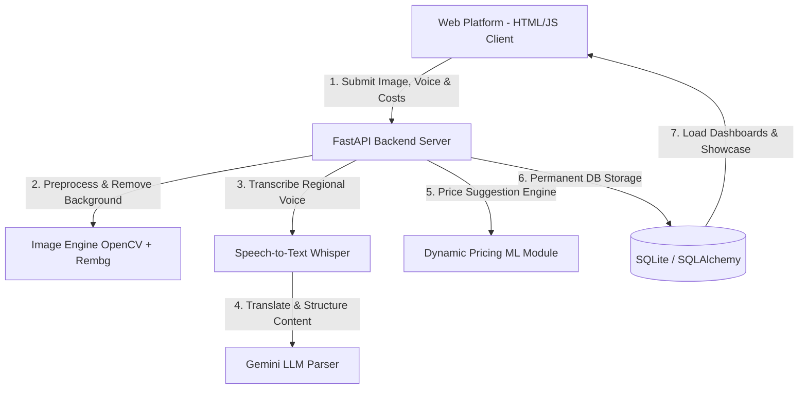

# Artisan AI Web Platform 🎨
> **AI-Driven Market Linkage & Smart Cataloging Web Application for Marginalized Artisans (SIH26090)**  
> A 'virtual business manager' web portal empowering micro-entrepreneurs, weavers, and artisans to seamlessly digitize inventory, optimize listings using AI, manage B2B inquiries, and link to national digital markets.

---

## 📌 Problem Statement Overview
* **PS Number:** SIH26090
* **Title:** AI-Driven Market Linkage and Smart Cataloging Mobile/Web Application for Marginalized Artisans
* **Category:** Software / Web Platform
* **Theme:** Inclusive Development & Socio-Economic Upliftment

---

## 📖 Background & Context
Government agencies actively support marginalized community artisans, weavers, and micro-entrepreneurs by hosting physical fairs (such as Shilp Samagam, Surajkund Mela, and Dilli Haat). While helpful, these fairs only offer temporary sales windows. 

Artisans struggle to transition to continuous, year-round online e-commerce due to:
* **Low Digital Literacy:** Complexity in handling modern listing portals.
* **Technical Barriers:** Difficulty in taking studio-quality photos, cropping, and cataloging.
* **Language Barriers:** Inability to write SEO-friendly product names and descriptions in English/Hindi.
* **Pricing Ambiguity:** Lack of market awareness to price their items competitively.

**Artisan AI** addresses this gap as an intuitive AI-driven web application that automates digitization, pricing recommendation, cataloging, and market linkages.

---

## ⚙️ Key Portal Capabilities

1. **AI Image Enhancer & Studio:** 
   An upload module that automatically removes cluttered background elements, corrects lighting, and scales photos to standard square e-commerce formats.
2. **Multilingual Auto-Cataloger:** 
   An audio transcription and translation pipeline. Artisans record voice notes in their regional language, and the AI translates and compiles these descriptions into English and Hindi with SEO keywords.
3. **Dynamic Pricing Assistant:** 
   An intelligent engine suggesting optimal retail/B2B selling prices based on the product category, materials used, production hours, and market comparison.
4. **Market Integration & Role-Based Dashboards:**
   * **Artisan Dashboard**: Custom product list, inventory status adjustments, incoming B2B bulk quote requests inbox.
   * **B2B Buyer Portal**: Full catalog directory with search/filters, and bulk inquiry submission modal.
   * **Cluster Aggregator Panel**: Aggregates member artisans, bulk catalog ingestion helper.
   * **Admin (MoSJE) Panel**: Verification console, broad notifications broadcast tool, usage analytics.

---

## 🔄 Technical Architecture & Workflow

Here is how the data flows from the client website to backend database registration:



---

## 📂 Project Structure

```
├── backend/                  # FastAPI Backend application
│   ├── main.py               # Main application entry point
│   ├── database.py           # SQLite SQLAlchemy database setup
│   ├── models.py             # User, Product, Inquiry, and Notification tables
│   ├── auth.py               # bcrypt password hashing & JWT handlers
│   ├── requirements.txt      # Python dependencies
│   ├── services/             # Core processing modules
│   │   ├── image_processor.py# Image enhancement & background removal
│   │   ├── cataloger.py      # Voice transcription & translation
│   │   └── pricing_assistant.py # Price modeling service
│   └── tests/                # Automated pytest files
└── frontend/                 # Web Platform Frontend
    ├── index.html            # Core HTML views for all roles
    ├── styles.css            # Custom layout, themes & charts styling
    └── app.js                # Javascript router, auth & API client
```

---

## 🚀 Running the Project

### 1. Automatic Startup (Windows)
Double-click `run.bat` in the project root directory. This will automatically spin up the backend server, the frontend web server, and open the portal in your browser.

### 2. Manual Startup

---

#### ⚠️ ONE-TIME SETUP (First time only — do NOT repeat every day)

Run these once to set up your Python environment and install dependencies:

```powershell
cd D:\SIH\backend
python -m venv .venv
.\.venv\Scripts\activate
pip install -r requirements.txt
```

---

#### ✅ DAILY STARTUP — Backend (3 commands, every time)

Open a terminal and run:

```powershell
cd D:\SIH\backend
.\.venv\Scripts\activate
python -m uvicorn main:app --host 0.0.0.0 --port 8000 --reload
```

Backend is now live at → `http://localhost:8000`

---

#### ✅ DAILY STARTUP — Frontend (2 commands, every time)

Open a **second terminal** and run:

```powershell
cd D:\SIH\frontend
npm start
```

Open `http://localhost:5500` in your browser.

---

#### Root-level npm scripts (optional shortcut):
From the root `D:\SIH\` folder:
```powershell
npm run start:frontend    # starts frontend server
npm run start:backend     # starts backend server
```
