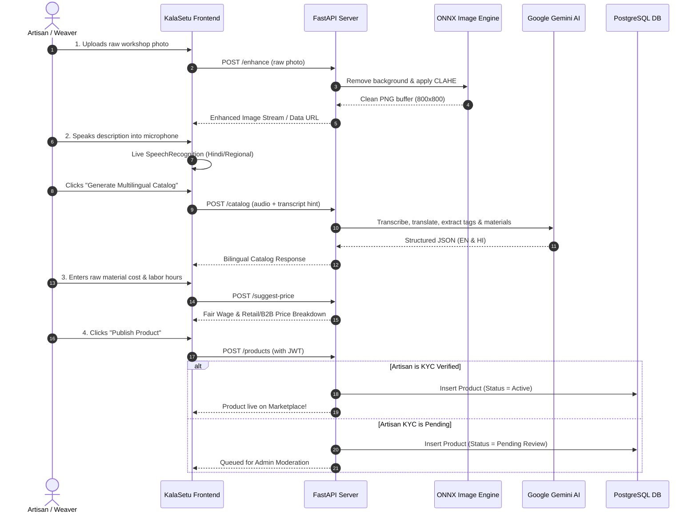
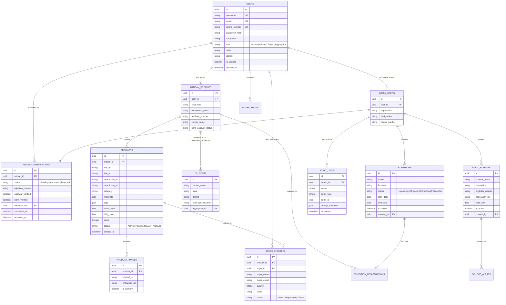

# 🎨 KalaSetu (Artisan AI) | कला सेतु

> **AI-Driven Market Linkage, Smart Multilingual Cataloging, and Governance Platform for Marginalized Artisans, Weavers & Micro-Entrepreneurs**  
> *Under the mandate of the Ministry of Social Justice and Empowerment (MoSJE) | Smart India Hackathon (SIH26090)*

---

<div align="center">


-005CED.svg?style=flat&logo=onnx&logoColor=white)


</div>

---

## 📌 Table of Contents
1. [Problem Statement & Background](#-problem-statement--background)
2. [Key Platform Capabilities](#-key-platform-capabilities)
   - [Artisan AI Studio & Virtual Manager](#1-artisan-ai-studio--virtual-manager)
   - [B2B Marketplace & Digital Linkages](#2-b2b-marketplace--digital-linkages)
   - [MoSJE Administrative Governance Console (7 Pillars)](#3-mosje-administrative-governance-console-7-pillars)
3. [System Architecture & Data Flow](#-system-architecture--data-flow)
4. [Database Schema (Entity-Relationship)](#-database-schema-entity-relationship)
5. [API Endpoint Reference](#-api-endpoint-reference)
6. [Dynamic Pricing & Fair Wage Engine](#-dynamic-pricing--fair-wage-engine)
7. [Tech Stack](#-tech-stack)
8. [Setup & Installation Guide](#-setup--installation-guide)
9. [How to Run](#-how-to-run)

---

## 📖 Problem Statement & Background

* **Problem Statement ID:** SIH26090
* **Theme:** Inclusive Socio-Economic Development & Direct Market Access
* **Target Beneficiaries:** Rural Artisans, Handloom Weavers, Pottery Masters, Tribal Craftsmen, and Micro-Enterprises.

### The Challenge
Government agencies regularly assist marginalized artisans by providing financial assistance, cluster development programs, and organizing traditional fairs (**Shilp Samagam**, **Surajkund Mela**, **Dilli Haat**). However, these events provide only temporary, intermittent sales windows. Once the fair concludes, artisans struggle to maintain digital continuity due to:
* **Digital & Technical Barriers:** Low digital literacy makes listing products on complex e-commerce platforms nearly impossible.
* **Photography & Visual Standards:** Inability to produce clean, isolated, studio-quality product photos in cluttered rural workshops.
* **Language & Content Barriers:** Difficulties formulating professional, SEO-optimized titles, descriptions, and keywords in English and standard Hindi.
* **Pricing Vulnerability:** Exploitation by middlemen, lack of market visibility, and selling below living wage benchmarks.

### The Solution: KalaSetu
**KalaSetu (Artisan AI)** functions as an autonomous **Virtual Business Manager**. It empowers artisans to photograph a product, speak in their native tongue, receive instant pricing intelligence, and publish directly to a national B2B wholesale and D2C marketplace under verified government governance.

---

## ⚙️ Key Platform Capabilities

### 1. Artisan AI Studio & Virtual Manager

```
┌─────────────────┐     ┌──────────────────┐     ┌──────────────────┐     ┌─────────────────┐
│ 1. Photo Studio │ ──> │ 2. Voice Catalog │ ──> │ 3. Smart Pricing │ ──> │ 4. Publish Item │
└─────────────────┘     └──────────────────┘     └──────────────────┘     └─────────────────┘
```

1. **AI Background Removal & Studio Lighting**:
   - Upload raw photos taken on any mobile camera in cluttered rural workshops.
   - Powered by a lightweight **ONNX `u2netp` model (4.5 MB)** consuming **< 80MB RAM** (versus standard 1GB+ models) with automatic input downscaling.
   - Applies **CLAHE (Contrast Limited Adaptive Histogram Equalization)** to balance natural exposure and centers the craft on a standard e-commerce canvas.
   - Side-by-side Before/After preview with single-click PNG download.

2. **Multilingual Voice & Text Cataloger**:
   - **Live Microphone Recording**: Speak directly into the browser with live sound wave animation and timer.
   - **Real-Time Speech-to-Text**: Converts spoken dialect into live text on screen via browser-native SpeechRecognition (`hi-IN`, `bn-IN`, `mr-IN`, `ta-IN`, `te-IN`, `gu-IN`, `kn-IN`, `en-IN`).
   - **Multimodal AI Generation**: Transcribes and translates speech using Google Gemini 1.5 Flash to create tailored English and Hindi e-commerce listings with extracted materials and SEO tags.
   - **Intelligent Fallback Engine**: Parses artisan vocabulary even in offline/mock mode.

3. **Dynamic Pricing & Fair Wage Assistant**:
   - Guarantees living wage protection based on a benchmark of **₹150/hour (₹1,200/day)**.
   - Calculates material costs, fair artisan wages, D2C retail price with craft multipliers, and a 15% wholesale discount for B2B bulk orders.
   - Benchmarks competitor price ranges across platforms (Amazon Karigar, Etsy, ONDC).

4. **1-Click Publishing & Moderation Pipeline**:
   - Aggregates bilingual titles, descriptions, stock, pricing, and the studio-enhanced image.
   - Automatically routes unverified artisans' listings to the MoSJE Admin Moderation Queue.

---

### 2. B2B Marketplace & Digital Linkages

* **Catalog Directory**: Real-time search by product name, materials, or craft technique.
* **Category Filtering**: Instant filtering across *Textiles*, *Handicrafts*, *Pottery*, *Jewelry*, *Paintings & Art*, and *Woodwork*.
* **B2B Bulk Inquiries**: Verified enterprise buyers can submit bulk quotation requests with specifications and quantity requirements.
* **Artisan Protection**: Unverified buyer accounts are restricted from spamming artisans until admin verification.

---

### 3. MoSJE Administrative Governance Console (7 Pillars)

| Pillar | Capability | Description |
| :--- | :--- | :--- |
| **1. Artisan KYC Verification** | Identity & Scheme Eligibility | Verify artisans via Aadhaar, bank KYC, craft specialization, state, and district. Filter by `Pending`, `Approved`, or `Rejected` with mandatory rejection reasons and audit logging. |
| **2. Cluster & Program Management** | Regional Handloom Clusters | Create craft clusters, assign artisans to clusters, and track cluster-level metrics (enrolled artisans, verified members, active products, and buyer inquiries). |
| **3. Exhibition Registry** | Fair-to-Digital Continuity | Digitize fairs (**Shilp Samagam**, **Surajkund Mela**, **Dilli Haat**), manage lifecycle states (`Upcoming` → `Ongoing` → `Completed` / `Cancelled`), and review artisan digital registrations. |
| **4. Government Schemes & Alerts** | Scheme Broadcast Engine | Publish central/state welfare schemes, toggle active status, broadcast targeted alerts filtered by target state or craft type, and inspect broadcast history logs. |
| **5. Product Listing Moderation** | Quality & Standard Control | Inspect unverified artisans' product submissions with full imagery and details before approving them to go live on the public directory. |
| **6. Platform Impact Analytics** | National Dashboard | Live analytics tracking artisan verification rates, buyer engagement, average product prices, state-wise adoption progress bars, and cluster output rankings. |
| **7. B2B Buyer Verification** | Enterprise Buyer KYC | Audit and verify institutional buyers, export houses, and retail chains before granting direct artisan outreach privileges. |

---

## 🔄 System Architecture & Data Flow

### High-Level System Architecture

```mermaid
flowchart TB
    subgraph Client["Frontend Client (React 18 + Vite)"]
        UI[KalaSetu React SPA]
        Studio[Artisan AI Studio]
        Admin[MoSJE Admin Console]
        Market[B2B Marketplace]
        STT[Web SpeechRecognition Engine]
    end

    subgraph Backend["FastAPI Application Server"]
        API[FastAPI Router & JWT Middleware]
        ImgSvc[ImageProcessor Service (OpenCV + u2netp)]
        CatSvc[Cataloger Service (Gemini 1.5 Flash)]
        PriceSvc[Pricing Assistant Engine]
        AuthSvc[Bcrypt + JWT Security]
    end

    subgraph Storage["Data & Model Layer"]
        PG[(PostgreSQL Database)]
        ONNX[u2netp ONNX Model (4.5 MB)]
        GeminiCloud[Google Gemini API]
    end

    UI -->|HTTP Requests / Multipart| API
    STT -->|Real-time Transcripts| Studio
    Studio -->|Upload Image| ImgSvc
    ImgSvc --> ONNX
    Studio -->|Audio / Voice Note| CatSvc
    CatSvc --> GeminiCloud
    Studio -->|Pricing Parameters| PriceSvc
    Admin -->|Governance & Moderation| API
    Market -->|Search & B2B Inquiries| API
    API --> AuthSvc
    API --> PG
```

### End-to-End Artisan Digitization Workflow



---

## 🗄️ Database Schema (Entity-Relationship)



---

## 📡 API Endpoint Reference

### 🔐 Authentication & Profile

| Method | Endpoint | Access | Description |
| :--- | :--- | :--- | :--- |
| `POST` | `/auth/register` | Public | Register an Artisan, Buyer, Aggregator, or Admin. |
| `POST` | `/auth/login` | Public | Authenticate with username/phone and password, returns JWT token. |
| `GET` | `/auth/me` | Authenticated | Retrieve current user profile and verification status. |

### 🪄 AI Studio & Processing

| Method | Endpoint | Access | Description |
| :--- | :--- | :--- | :--- |
| `POST` | `/enhance` | Public / Artisan | Accepts raw image upload, removes background with `u2netp`, applies CLAHE, returns enhanced PNG. |
| `POST` | `/catalog` | Public / Artisan | Multilingual speech-to-text and AI catalog generator (audio/text in Hindi/regional → EN/HI catalog). |
| `POST` | `/suggest-price` | Public / Artisan | Dynamic pricing & fair wage calculation based on material costs, hours, and category multipliers. |
| `POST` | `/products` | Artisan | Create a product listing. Auto-routes to `Pending Review` if artisan KYC is pending. |
| `GET` | `/products` | Public | Search and filter active catalog products by category or query. |

### 🛍️ B2B Marketplace & Inquiries

| Method | Endpoint | Access | Description |
| :--- | :--- | :--- | :--- |
| `POST` | `/inquiries` | Buyer | Submit a bulk purchase quotation inquiry to an artisan cooperative (requires verified buyer). |
| `GET` | `/inquiries` | Authenticated | Retrieve incoming or sent quotation inquiries. |
| `GET` | `/notifications` | Authenticated | Fetch personalized alerts, scheme broadcasts, and verification updates. |

### 🛡️ MoSJE Administration & Governance

| Method | Endpoint | Access | Description |
| :--- | :--- | :--- | :--- |
| `GET` | `/admin/verifications` | Admin | List artisan verification queue with `status_filter` (`Pending`, `Approved`, `Rejected`). |
| `POST` | `/admin/verifications/{id}/review` | Admin | Approve or reject artisan KYC with Aadhaar/bank flags and rejection rationale. |
| `GET` | `/admin/clusters` | Admin / Aggregator | List all handloom and handicraft clusters. |
| `POST` | `/admin/clusters` | Admin | Create a new craft cluster by state, district, and specialization. |
| `GET` | `/admin/clusters/{id}/stats` | Admin | Performance statistics for a cluster (members, verified count, products, inquiries). |
| `POST` | `/admin/clusters/{id}/assign-artisan` | Admin | Assign an artisan to a specific cluster. |
| `GET` | `/admin/schemes` | Public / Admin | List all active government schemes. |
| `POST` | `/admin/schemes` | Admin | Publish a new central/state welfare scheme. |
| `PUT` | `/admin/schemes/{id}` | Admin | Update scheme details or toggle active status. |
| `POST` | `/admin/schemes/{id}/broadcast` | Admin | Broadcast targeted alert notifications filtered by state or craft. |
| `GET` | `/admin/schemes/{id}/alerts` | Admin | View broadcast history log for a scheme. |
| `GET` | `/admin/exhibitions` | Public / Admin | List all physical fairs & exhibitions. |
| `POST` | `/admin/exhibitions` | Admin | Schedule a new fair (Shilp Samagam, Surajkund Mela, Dilli Haat). |
| `PUT` | `/admin/exhibitions/{id}/status` | Admin | Update fair lifecycle (`Upcoming`, `Ongoing`, `Completed`, `Cancelled`). |
| `POST` | `/admin/exhibitions/{id}/register` | Artisan | Register an artisan digitally for an exhibition. |
| `GET` | `/admin/exhibitions/{id}/registrations/detailed` | Admin | Review detailed artisan registrations for a fair. |
| `GET` | `/admin/products/flagged` | Admin | List pending products awaiting moderation. |
| `POST` | `/admin/products/{id}/moderate` | Admin | Approve (`Active`) or archive (`Archived`) a product listing with audit logs. |
| `GET` | `/admin/buyers` | Admin | Directory of all registered B2B buyers and inquiries sent. |
| `POST` | `/admin/buyers/{id}/verify` | Admin | Verify or revoke buyer enterprise credentials. |
| `GET` | `/admin/analytics` | Admin | Complete platform metrics (verification rates, average prices, state breakdown, cluster rankings). |
| `GET` | `/admin/audit-logs` | Admin | Tamper-evident audit trail stream of all administrative actions. |

---

## 💰 Dynamic Pricing & Fair Wage Engine

The pricing assistant uses a **cost-plus fair wage formula** combined with **craft value multipliers**:

$$\text{Fair Labor Wage} = \text{Manufacturing Hours} \times ₹150/\text{hr}$$

$$\text{Min. Production Floor} = \text{Raw Material Cost} + \text{Fair Labor Wage}$$

$$\text{Recommended Retail Price (D2C)} = \text{Min. Production Floor} \times \text{Craft Multiplier}$$

$$\text{B2B Wholesale Price} = \text{Recommended Retail Price} \times 0.85\quad (\text{15\% Bulk Discount})$$

$$\text{Market Range} = [\text{Retail Price} \times 0.90] \quad\text{to}\quad [\text{Retail Price} \times 1.40]$$

### Craft Multiplier Table
* **Folk Paintings & Art:** `2.0×` (High artistic originality & one-off uniqueness)
* **Tribal & Silver Jewelry:** `1.8×` (Precious material handling & intricate filigree)
* **Textiles & Handloom:** `1.5×` (Complex loom setup & warp/weft intricacy)
* **Handicrafts & Woodwork:** `1.4×` (Carving time, seasoning & decorative demand)
* **Clay & Blue Pottery:** `1.3×` (Clay volume, kiln firing cycles & daily utility)

---

## 🛠️ Tech Stack

### Frontend (SPA)
* **Framework:** React 18 (`react`, `react-dom`)
* **Build Tool:** Vite 5
* **Icons:** Lucide React (`lucide-react`)
* **Audio & Speech:** Browser Web Audio API + Web SpeechRecognition (`webkitSpeechRecognition`)
* **Styling:** Vanilla CSS3 Design System with custom dark palette, responsive tables, and metrics grid.

### Backend (REST API)
* **Web Framework:** FastAPI (Python 3.10+)
* **ASGI Server:** Uvicorn
* **Database ORM:** SQLAlchemy 2.0
* **Database Engine:** PostgreSQL 15+ (`psycopg2-binary`)
* **Authentication:** JWT (`python-jose[cryptography]`) + Passlib (`bcrypt`)
* **Image Processing:** OpenCV (`opencv-python`) + Pillow (`Pillow`)
* **AI Background Removal:** Rembg (`rembg` with ONNX `u2netp` runtime)
* **Multimodal LLM:** Google Gemini 1.5 Flash (`google-genai`)
* **Validation:** Pydantic v2

---

## ⚙️ Setup & Installation Guide

### Prerequisites
* **Node.js** (v18 or higher) & **npm**
* **Python** (v3.10 or higher)
* **PostgreSQL Server** (running locally on port `5432` or via cloud instance)

---

### Step 1: Clone the Repository & Configure Environment

```powershell
cd Kama-Setu
```

Ensure `backend/.env` is configured with your PostgreSQL and optional Gemini credentials:

```env
USE_POSTGRES=true
POSTGRES_USER=postgres
POSTGRES_PASSWORD=your_postgres_password
POSTGRES_HOST=localhost
POSTGRES_PORT=5432
POSTGRES_DB=kala_setu

# Optional: To enable cloud audio transcription with Google Gemini 1.5 Flash
GEMINI_API_KEY=your_gemini_api_key_here
```

---

### Step 2: Backend Installation

```powershell
cd backend
python -m venv venv
.\venv\Scripts\activate
pip install -r requirements.txt
```

---

### Step 3: Frontend Installation

```powershell
cd ..\frontend
npm install
```

---

### Step 4: Add an Initial MoSJE Admin (Optional Command)

You can register an Admin directly via the API or run this one-line command from the `backend/` directory:

```powershell
cd backend
.\venv\Scripts\python.exe -c "
from database import SessionLocal
import models, auth, uuid

db = SessionLocal()
if not db.query(models.User).filter_by(username='admin').first():
    user = models.User(
        username='admin',
        full_name='MoSJE Administrator',
        email='admin@mosje.gov.in',
        phone_number='9999999999',
        password_hash=auth.hash_password('admin123'),
        role='Admin',
        is_verified=True,
        state='New Delhi',
        district='Central Delhi'
    )
    db.add(user)
    db.commit()
    db.refresh(user)
    admin_profile = models.AdminUser(
        user_id=user.id,
        department='Ministry of Social Justice & Empowerment',
        designation='Director of Handicrafts',
        badge_number='MOSJE-DIR-001'
    )
    db.add(admin_profile)
    db.commit()
    print('Admin created: username=admin, password=admin123')
else:
    print('Admin user already exists.')
db.close()
"
```

---

## 🚀 How to Run

### Option 1: Quick Launch (Windows)
Double-click [`run.bat`](file:///d:/AMOL/Modding/MiniProjects/KalaSetu/Kama-Setu/run.bat) in the project root directory. It will launch the FastAPI backend on port `8000`, the React Vite frontend on port `5173`, and open your browser automatically.

---

### Option 2: Manual Startup (Two Terminals)

**Terminal 1 — FastAPI Backend:**
```powershell
cd backend
.\venv\Scripts\python.exe -m uvicorn main:app --host 0.0.0.0 --port 8000 --reload
```

**Terminal 2 — React Vite Frontend:**
```powershell
cd frontend
npm run dev
```

* **React Frontend Portal:** [http://localhost:5173](http://localhost:5173)
* **Interactive OpenAPI Docs (Swagger):** [http://localhost:8000/docs](http://localhost:8000/docs)
* **Alternative API Docs (ReDoc):** [http://localhost:8000/redoc](http://localhost:8000/redoc)

---

<div align="center">

**KalaSetu (कला सेतु)** — *Empowering Indian Artisans through AI, Fair Wages & Digital Market Linkages.*  
Developed for the **Smart India Hackathon (SIH26090)** under the **Ministry of Social Justice & Empowerment (MoSJE)**.

</div>
