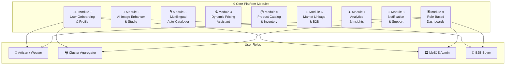
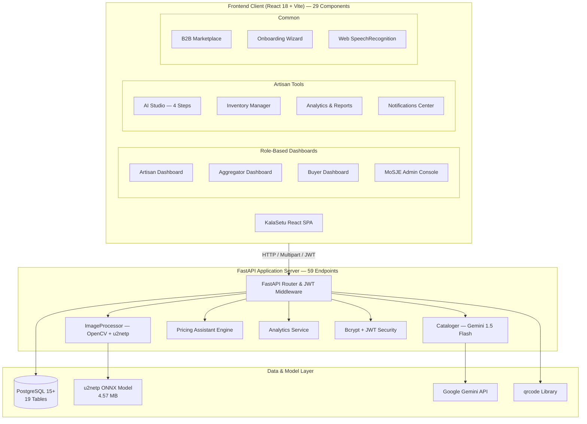
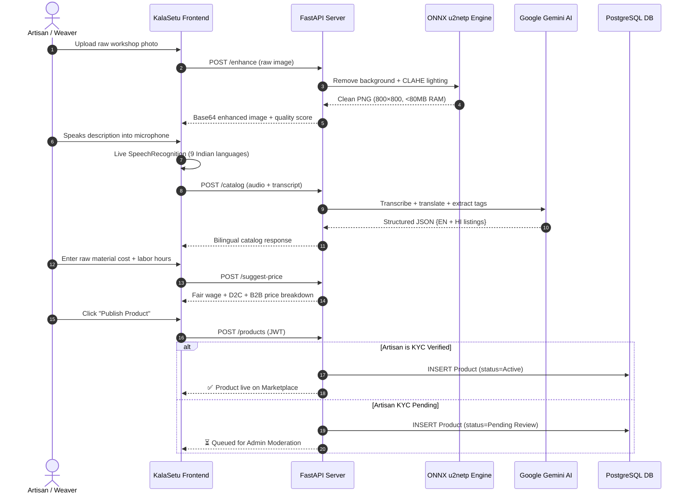
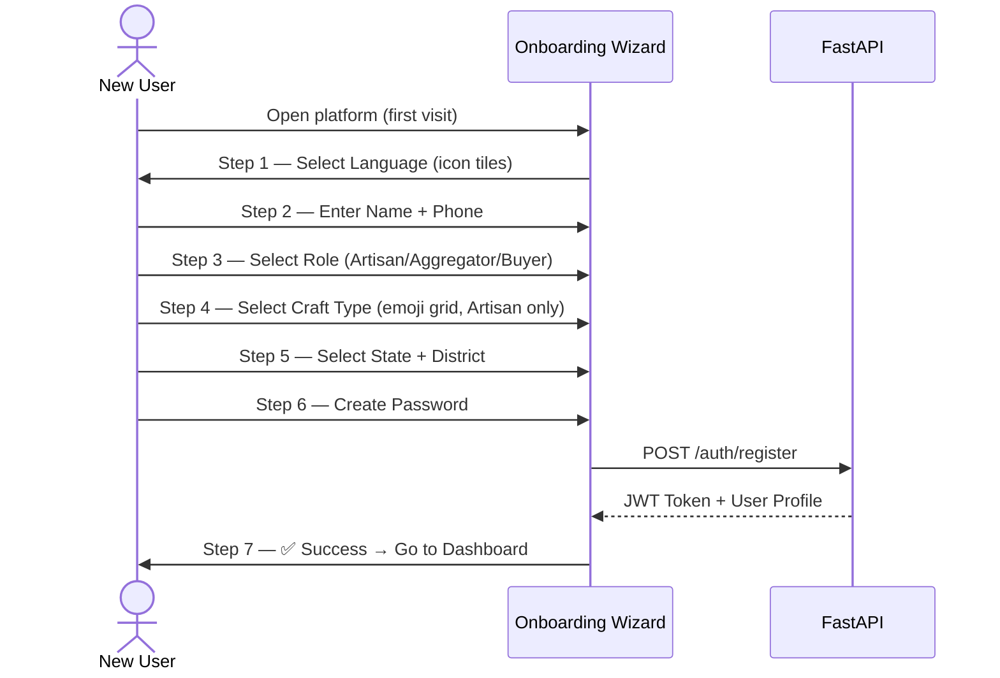

# 🎨 KalaSetu (Artisan AI) | कला सेतु

> **AI-Driven Market Linkage, Smart Multilingual Cataloging, and Governance Platform for Marginalized Artisans, Weavers & Micro-Entrepreneurs**  
> *Under the mandate of the Ministry of Social Justice and Empowerment (MoSJE) | Smart India Hackathon (SIH26090)*

---

<div align="center">


-005CED.svg?style=flat&logo=onnx&logoColor=white)


</div>

---

## 📌 Table of Contents

1. [Problem Statement & Background](#-problem-statement--background)
2. [Platform Architecture & 9-Module System](#-platform-architecture--9-module-system)
3. [User Roles & Role-Based Dashboards](#-user-roles--role-based-dashboards)
4. [Module Deep-Dives](#️-module-deep-dives)
   - [Module 1 — User Onboarding & Profile Management](#module-1--user-onboarding--profile-management)
   - [Module 2 — AI Image Enhancer & Studio](#module-2--ai-image-enhancer--studio)
   - [Module 3 — Multilingual Auto-Cataloger](#module-3--multilingual-auto-cataloger)
   - [Module 4 — Dynamic Pricing Assistant](#module-4--dynamic-pricing-assistant)
   - [Module 5 — Product Catalog & Inventory Management](#module-5--product-catalog--inventory-management)
   - [Module 6 — Market Linkage & B2B Connection](#module-6--market-linkage--b2b-connection)
   - [Module 7 — Analytics & Insights](#module-7--analytics--insights)
   - [Module 8 — Notification & Support](#module-8--notification--support)
   - [Module 9 — Role-Based Dashboards](#module-9--role-based-dashboards)
5. [MoSJE Governance Console (7 Pillars)](#-mosje-governance-console-7-pillars)
6. [System Architecture & Data Flow](#-system-architecture--data-flow)
7. [Database Schema (Entity-Relationship)](#️-database-schema-entity-relationship)
8. [API Endpoint Reference (59 Endpoints)](#-api-endpoint-reference-59-endpoints)
9. [Dynamic Pricing & Fair Wage Engine](#-dynamic-pricing--fair-wage-engine)
10. [Tech Stack](#️-tech-stack)
11. [Setup & Installation Guide](#-setup--installation-guide)
12. [How to Run](#-how-to-run)

---

## 📖 Problem Statement & Background

* **Problem Statement ID:** SIH26090
* **Theme:** Inclusive Socio-Economic Development & Direct Market Access
* **Target Beneficiaries:** Rural Artisans, Handloom Weavers, Pottery Masters, Tribal Craftsmen, and Micro-Enterprises.

### The Challenge

Government agencies regularly assist marginalized artisans by providing financial assistance, cluster development programs, and organizing traditional fairs (**Shilp Samagam**, **Surajkund Mela**, **Dilli Haat**). However, these events provide only temporary, intermittent sales windows. Once the fair concludes, artisans struggle to maintain digital continuity due to:

* **Digital & Technical Barriers:** Low digital literacy makes listing products on complex e-commerce platforms nearly impossible.
* **Photography & Visual Standards:** Inability to produce clean, studio-quality product photos in cluttered rural workshops.
* **Language & Content Barriers:** Difficulties formulating professional, SEO-optimized titles and descriptions in English and standard Hindi.
* **Pricing Vulnerability:** Exploitation by middlemen, lack of market visibility, and selling below living wage benchmarks.

### The Solution: KalaSetu

**KalaSetu (Artisan AI)** functions as an autonomous **Virtual Business Manager**. It empowers artisans to photograph a product, speak in their native tongue, receive instant pricing intelligence, and publish directly to a national B2B wholesale and D2C marketplace under verified government governance.

---

## 🧩 Platform Architecture & 9-Module System



---

## 👥 User Roles & Role-Based Dashboards

KalaSetu implements **full role-based routing** — each role sees a completely tailored experience:

| Role | Default View | Accessible Modules |
|:---|:---|:---|
| **Artisan / Weaver** | Artisan Dashboard | Dashboard · AI Studio · Inventory · Analytics · Notifications · Profile · Marketplace |
| **Cluster Aggregator** | Aggregator Dashboard | Cluster Management · Artisan Directory · Marketplace |
| **B2B Buyer** | Buyer Dashboard | Inquiry Tracker · Browse Catalog · Matched Artisans |
| **MoSJE Admin** | Admin Console | Full Governance Console (7 Pillars) |
| **Unauthenticated** | Marketplace | Browse Only (read-only) |

---

## ⚙️ Module Deep-Dives

### Module 1 — User Onboarding & Profile Management

**Visual, low-literacy-first onboarding wizard** with 7 guided steps:

```
Step 1         Step 2         Step 3         Step 4         Step 5         Step 6         Step 7
Language   →   Name+Phone  →  Role Select →  Craft Type  →  Region      →  Password    →  ✅ Success
(icon tiles)                  (illustrated)  (emoji grid)   (State+Dist)
```

**Features:**
- (i) Artisan registration with minimal input (name, craft type, region, preferred language)
- (ii) **Voice-guided onboarding** — visual icon tiles, no reading skills required
- (iii) Profile management with craft/trade category tagging
- (iv) Role-based access: **Artisan · Aggregator · Admin · Buyer**
- (v) **Aadhaar / Government ID verification** support with admin KYC review
- (vi) **Language preference settings** — Hindi, English, Bengali, Tamil, Telugu, Marathi, Gujarati, Kannada, Odia

**Supported Craft Categories (visual tiles):**
🧵 Textiles · 🏺 Pottery · 💎 Jewelry · 🪵 Woodcraft · 🎨 Paintings · 🔨 Metal Craft

---

### Module 2 — AI Image Enhancer & Studio

**Memory-safe, production-ready AI photo studio** optimized for rural mobile cameras:

- (i) **AI Background Removal** — powered by lightweight **ONNX `u2netp` (4.57 MB)** consuming **< 80 MB RAM** (vs 1+ GB for standard models)
- (ii) **Automatic lighting correction** — CLAHE (Contrast Limited Adaptive Histogram Equalization) for balanced exposure
- (iii) **Professional formatting** — centers product on white/neutral canvas at standard e-commerce aspect ratios
- (iv) **Batch upload & enhancement** — submit up to N images at once via `POST /enhance/batch`
- (v) **Before/After preview** — side-by-side comparison with single-click PNG download
- (vi) **Image quality scoring** — Laplacian sharpness, brightness, and contrast analyzed → `0–100` overall score + `Excellent / Good / Fair / Poor` rating

**Supported Product Types:**
🧵 Textiles & Handloom · 🏺 Handicrafts & Pottery · 💎 Jewelry & Accessories · 🪵 Wooden/Metal Craft · 🎨 Paintings & Wall Art

**Auto-downscaling pipeline:**
```
Raw Camera Photo → Resize to ≤1024px → u2netp ONNX → CLAHE → 800×800 Canvas → Base64 Output
```

---

### Module 3 — Multilingual Auto-Cataloger

**Real-time voice-to-catalog pipeline** supporting 9 Indian languages:

- (i) **Live microphone recording** in browser — animated sound wave, digital `MM:SS / 01:00` timer
- (ii) **Real-time Speech-to-Text** — `webkitSpeechRecognition` transcribes speech to text on-screen as artisan speaks
- (iii) **Automatic bilingual translation** — Google Gemini 1.5 Flash translates and expands to English + Hindi
- (iv) **SEO-friendly description generation** — extracts materials, occasions, and tags for e-commerce optimization
- (v) **Product category auto-tagging** — craft type, material, occasion, technique extracted automatically
- (vi) **Draft review & edit** before publishing — all fields editable by artisan
- (vii) **Text-based input fallback** — for artisans with partial digital literacy

**Supported Languages:**

| Voice Input | Output |
|:---|:---|
| Hindi (hi-IN), Bengali (bn-IN), Tamil (ta-IN), Telugu (te-IN) | English (EN) |
| Marathi (mr-IN), Gujarati (gu-IN), Kannada (kn-IN), Odia (or-IN) | Hindi (HI) |

**Intelligent fallback engine:** When Gemini API key is unavailable, a dynamic keyword parser categorizes spoken vocabulary (saree, silk, brass, pottery, jewelry, paintings, etc.) and generates customized bilingual listings.

---

### Module 4 — Dynamic Pricing Assistant

**Cost-plus fair wage formula** with craft multipliers and market benchmarking:

- (i) ML-style pricing algorithm analyzing product category + material
- (ii) **Competitive price suggestion** based on current market bands (Amazon Karigar, Etsy, ONDC)
- (iii) Raw material cost consideration in all calculations
- (iv) **3-tier price display**: Min. Breakeven · Recommended D2C · Premium
- (v) Market competitor range comparison
- (vi) **Artisan override** — publish at any custom price

**Pricing Factors:** Product category · Material type · Craft multiplier · Raw material costs · Regional demand · Seasonal variations

See full formulas in [Dynamic Pricing & Fair Wage Engine](#-dynamic-pricing--fair-wage-engine).

---

### Module 5 — Product Catalog & Inventory Management

**Full digital catalog lifecycle management:**

- (i) Digital catalog creation with AI-enhanced images + auto-generated bilingual descriptions
- (ii) **Inventory tracking** — stock count per product with +/− counter UI
- (iii) **Product listing management** — 5 lifecycle states:

| Status | Description |
|:---|:---|
| `Active` | Live on public marketplace |
| `Draft` | Saved, not yet published |
| `Sold Out` | Auto-set when stock reaches 0 |
| `Archived` | Removed from listing, data retained |
| `Pending Review` | Awaiting MoSJE moderation (unverified artisans) |

- (iv) **Bulk catalog** upload and batch AI enhancement
- (v) **Search & filter** by category, material, price range, status
- (vi) **QR code catalog sharing** — every product generates a scannable QR PNG (`GET /products/{id}/qr`) for exhibitions and trade fairs

---

### Module 6 — Market Linkage & B2B Connection

**Direct artisan-to-buyer digital channels:**

- (i) Integration hooks for GeM portal and state e-marketplaces
- (ii) **B2B buyer discovery** — verified buyers browse, filter, and contact artisans
- (iii) **Inquiry & order management** — status tracking (Pending → Responded → Completed)
- (iv) **Exhibition digital presence** — QR-linked virtual stalls for Shilp Samagam, Surajkund Mela, Dilli Haat
- (v) **Bulk order request handling** for aggregators and SHG coordinators
- (vi) Artisan profile visibility with verified government badge

**Connected Channels:**
- 🏛️ Government e-Marketplaces (GeM, state portals)
- 🏢 B2B Buyers & Wholesale Aggregators
- 🎪 Exhibition & Trade Fair Digital Catalogs

---

### Module 7 — Analytics & Insights

**Per-listing and platform-wide analytics:**

**Artisan-Level (personal dashboard):**
- (i) Product view count tracking per listing (via `ProductView` table)
- (ii) Sales performance: orders received, revenue estimate
- (iii) Top-performing products by inquiry volume
- (iv) Market demand trends for their craft categories
- (v) **Visual, icon/chart-based dashboards** for low-literacy users (CSS bar charts, emoji indicators)
- CSV export of full product analytics report

**Admin-Level (platform-wide):**
- Total artisans, verified count, new registrations
- Buyer engagement rates, average product prices
- State-wise adoption progress bars
- Cluster output rankings

---

### Module 8 — Notification & Support

**Multilingual alert and communication system:**

- (i) **Order inquiry alerts** — buyer sends inquiry → artisan gets instant notification
- (ii) **Price update alerts** for listed products
- (iii) **Government scheme broadcasts** — admin targets by state or craft type
- (iv) **Exhibition opportunity alerts** — upcoming fair registrations
- (v) **In-app notifications center** with type icons, filter tabs (All / Unread / Inquiry / Scheme / Verification), and mark-read controls

**Notification Types:** 🔔 System · 💬 Inquiry · 🏛️ Verification · 📢 Scheme Alert · 🎪 Exhibition

---

### Module 9 — Role-Based Dashboards

#### 🧵 Artisan Dashboard
*The core user experience — simplified, visual, low-literacy friendly:*

| Feature | Details |
|:---|:---|
| Stat cards | Total listings, product views, inquiry count, revenue estimate |
| Top Products | Top 4 products by inquiry + view count with status badges |
| Quick Actions | 6-button grid: AI Studio · Inventory · Analytics · Inquiries · Notifications · Profile |
| Exhibition Panel | Upcoming fair registrations with approval status |
| Add Product CTA | Direct link to 4-step AI Studio pipeline |

#### 🏘️ Aggregator Dashboard
*Manages a cohort of artisans across one or more clusters:*

- Cluster summary cards (total artisans, active listings, artisans needing support)
- Per-cluster accordion with full artisan roster
- Per-artisan: name, craft type, verification badge, listing count, "Needs Support" flag
- Export artisan list

#### 🏢 B2B Buyer Dashboard
*Commerce-focused browsing and inquiry management:*

- Inquiry history table with status tabs (Pending / Responded / Completed)
- Suggested artisans matched to past inquiry craft categories
- Send new inquiry from dashboard
- Verified buyer badge display

#### 🏛️ Admin Dashboard (MoSJE Governance)
See [MoSJE Governance Console](#-mosje-governance-console-7-pillars) below.

---

## 🏛️ MoSJE Governance Console (7 Pillars)

| Pillar | Capability | Description |
| :--- | :--- | :--- |
| **1. Artisan KYC Verification** | Identity & Scheme Eligibility | Verify artisans via Aadhaar, bank KYC, craft specialization, state, and district. Filter by `Pending`, `Approved`, or `Rejected` with mandatory rejection reasons and audit logging. |
| **2. Cluster & Program Management** | Regional Handloom Clusters | Create craft clusters by region and specialization, assign artisans to clusters, and track cluster-level metrics (enrolled artisans, verified members, active products, buyer inquiries). |
| **3. Exhibition Registry** | Fair-to-Digital Continuity | Digitize fairs (**Shilp Samagam**, **Surajkund Mela**, **Dilli Haat**), manage lifecycle (`Upcoming → Ongoing → Completed / Cancelled`), review artisan digital registrations. |
| **4. Government Schemes & Alerts** | Scheme Broadcast Engine | Publish central/state welfare schemes, toggle active status, broadcast targeted alerts filtered by state or craft type, and inspect broadcast history logs. |
| **5. Product Listing Moderation** | Quality & Standard Control | Inspect unverified artisans' product submissions with full imagery before approving them to go live on the public directory. |
| **6. Platform Impact Analytics** | National Dashboard | Live analytics: artisan verification rates, buyer engagement, average product prices, state-wise adoption, and cluster output rankings. |
| **7. B2B Buyer Verification** | Enterprise Buyer KYC | Audit and verify institutional buyers, export houses, and retail chains before granting direct artisan outreach privileges. |

---

## 🔄 System Architecture & Data Flow

### High-Level System Architecture



### Artisan 4-Step Studio Workflow



### Onboarding Flow



---

## 🗄️ Database Schema (Entity-Relationship)

19 PostgreSQL tables across 5 functional groups:

```mermaid
erDiagram
    USERS ||--o| ARTISAN_PROFILES : "has profile"
    USERS ||--o| ADMIN_USERS : "has admin record"
    USERS ||--o{ ARTISAN_VERIFICATIONS : "submitted by"
    USERS ||--o{ BUYER_INQUIRIES : "sent by (Buyer)"
    USERS ||--o{ NOTIFICATIONS : "receives"
    USERS ||--o{ CLUSTER_ARTISANS : "member of"
    USERS ||--o{ EXHIBITION_REGISTRATIONS : "registers for"
    USERS ||--o{ MANAGED_CLUSTERS : "manages (Aggregator)"
    USERS ||--o{ SCHEME_ALERTS : "broadcasts (Admin)"

    ARTISAN_PROFILES ||--o{ PRODUCTS : "creates"
    ARTISAN_PROFILES ||--o{ VOICE_INPUTS : "records"

    PRODUCTS ||--o{ PRODUCT_IMAGES : "has images"
    PRODUCTS ||--o{ BUYER_INQUIRIES : "subject of"
    PRODUCTS ||--o{ PRICING_SUGGESTIONS : "priced by"
    PRODUCTS ||--o{ PRODUCT_VIEWS : "tracked by"
    PRODUCTS ||--o{ VOICE_INPUTS : "described by"

    CLUSTERS ||--o{ CLUSTER_ARTISANS : "contains"
    EXHIBITIONS ||--o{ EXHIBITION_REGISTRATIONS : "includes"
    GOVT_SCHEMES ||--o{ SCHEME_ALERTS : "broadcasts"
    ADMIN_USERS ||--o{ AUDIT_LOGS : "logs actions"

    USERS {
        uuid id PK
        string username UK
        string email UK
        string phone_number UK
        string password_hash
        string full_name
        string role "Admin | Artisan | Buyer | Aggregator"
        string state
        string district
        string preferred_language
        boolean is_verified
        datetime created_at
    }

    ARTISAN_PROFILES {
        uuid id PK
        uuid user_id FK
        string craft_type
        string cluster_name
        string aadhaar_number
        string bank_account
        string ifsc_code
        string upi_id
        boolean govt_scheme_beneficiary
        string photo_url
    }

    PRODUCTS {
        uuid id PK
        uuid artisan_id FK
        string title_en
        string title_hi
        string description_en
        string description_hi
        string craft_category
        string material
        string dimensions
        decimal base_price
        decimal suggested_price
        integer stock_count
        integer view_count
        string status "Active|Draft|Sold Out|Archived|Pending Review"
        datetime created_at
    }

    PRODUCT_IMAGES {
        uuid id PK
        uuid product_id FK
        string original_url
        string enhanced_url
        boolean bg_removed
        boolean is_primary
        integer display_order
    }

    PRODUCT_VIEWS {
        uuid id PK
        uuid product_id FK
        string viewer_ip
        datetime viewed_at
    }

    PRICING_SUGGESTIONS {
        uuid id PK
        uuid product_id FK
        decimal min_price
        decimal suggested_price
        decimal premium_price
        string pricing_rationale
        jsonb market_data_snapshot
        datetime generated_at
    }

    VOICE_INPUTS {
        uuid id PK
        uuid product_id FK
        uuid artisan_id FK
        string audio_url
        string source_language
        string transcribed_text
        string translated_en
        string translated_hi
        string processing_status "Pending|Processing|Completed|Failed"
    }

    BUYER_INQUIRIES {
        uuid id PK
        uuid product_id FK
        uuid buyer_id FK
        uuid artisan_id FK
        integer quantity
        string message
        string status "Pending|Responded|Completed"
        datetime created_at
        datetime responded_at
    }

    NOTIFICATIONS {
        uuid id PK
        uuid user_id FK
        string title
        string body
        string lang_tag
        string type "System|Inquiry|Verification|Update"
        boolean is_read
        datetime sent_at
    }

    CLUSTERS {
        uuid id PK
        string cluster_name
        string state
        string district
        string craft_specialization
        uuid aggregator_id FK
        integer total_artisans
    }

    CLUSTER_ARTISANS {
        uuid id PK
        uuid cluster_id FK
        uuid artisan_id FK
        datetime joined_at
    }

    ARTISAN_VERIFICATIONS {
        uuid id PK
        uuid artisan_id FK
        uuid reviewed_by FK
        string status "Pending|Approved|Rejected"
        string rejection_reason
        boolean aadhaar_verified
        boolean bank_verified
        datetime submitted_at
        datetime reviewed_at
    }

    GOVT_SCHEMES {
        uuid id PK
        string scheme_name
        string description
        string eligibility_criteria
        string application_url
        uuid created_by FK
        boolean is_active
        date valid_until
    }

    SCHEME_ALERTS {
        uuid id PK
        uuid scheme_id FK
        uuid sent_by FK
        string target_state
        string target_craft_type
        integer recipients_count
        datetime sent_at
    }

    EXHIBITIONS {
        uuid id PK
        string name
        string location
        string status "Upcoming|Ongoing|Completed|Cancelled"
        date start_date
        date end_date
        uuid created_by FK
        boolean is_active
    }

    EXHIBITION_REGISTRATIONS {
        uuid id PK
        uuid exhibition_id FK
        uuid artisan_id FK
        string status "Pending|Approved|Rejected|Attended"
        datetime registered_at
    }

    ADMIN_USERS {
        uuid id PK
        uuid user_id FK
        string department
        string designation
        string access_level "Superadmin|Editor|Viewer"
        datetime last_login
    }

    AUDIT_LOGS {
        uuid id PK
        uuid admin_id FK
        string action
        string entity_type
        uuid entity_id
        jsonb change_snapshot
        string ip_address
        datetime created_at
    }
```



---

## 📡 API Endpoint Reference (59 Endpoints)

### 🔐 Authentication & User Management

| Method | Endpoint | Access | Description |
| :--- | :--- | :--- | :--- |
| `POST` | `/auth/register` | Public | Register Artisan, Buyer, Aggregator, or Admin with role, language, and craft details. |
| `POST` | `/auth/login` | Public | Authenticate and receive a JWT Bearer token. |
| `GET` | `/auth/me` | Authenticated | Retrieve current user profile and verification status. |

---

### 🪄 AI Studio & Processing

| Method | Endpoint | Access | Description |
| :--- | :--- | :--- | :--- |
| `POST` | `/enhance` | Artisan | Remove background with `u2netp` ONNX, apply CLAHE lighting, return enhanced PNG + quality score. |
| `POST` | `/enhance/batch` | Artisan | Batch enhance multiple product images. Returns array of Base64 results + quality scores. |
| `POST` | `/catalog` | Artisan | Voice/text → bilingual EN+HI catalog via Google Gemini 1.5 Flash. |
| `POST` | `/suggest-price` | Artisan | Fair wage + retail + B2B price suggestion from material cost, hours, and category. |

---

### 📦 Product Catalog & Inventory

| Method | Endpoint | Access | Description |
| :--- | :--- | :--- | :--- |
| `POST` | `/products` | Artisan | Create a listing. Auto-routes to `Pending Review` if artisan KYC is pending. |
| `GET` | `/products` | Public | Search/filter active catalog by category, material, or keyword. |
| `GET` | `/products/{id}` | Public | Get single product detail. Increments `view_count` and logs `ProductView`. |
| `PUT` | `/products/{id}` | Artisan | Update product title, description, price, or stock. |
| `DELETE` | `/products/{id}` | Artisan | Archive (soft-delete) a product listing. |
| `PUT` | `/products/{id}/status` | Artisan | Toggle status: `Active · Draft · Sold Out · Archived · Pending Review`. |
| `PUT` | `/products/{id}/stock` | Artisan | Update stock count. Auto-sets `Sold Out` when stock reaches 0. |
| `GET` | `/products/{id}/qr` | Public | Generate and return a scannable QR code PNG for catalog sharing at exhibitions. |

---

### 🧵 Artisan Profile & Dashboard

| Method | Endpoint | Access | Description |
| :--- | :--- | :--- | :--- |
| `GET` | `/artisan/dashboard` | Artisan | Summary dashboard: listing counts, views, inquiries, revenue estimate, pending items, upcoming exhibitions. |
| `GET` | `/artisan/profile` | Artisan | Full profile: user info, craft type, cluster, bank details, KYC status. |
| `PUT` | `/artisan/profile` | Artisan | Update language preference, craft type, bank account, UPI ID, Aadhaar, name, region. |
| `GET` | `/artisan/analytics` | Artisan | Per-product analytics: views, inquiries, completed orders, revenue estimate, top products. |
| `GET` | `/artisan/report` | Artisan | Export full analytics as downloadable CSV file. |

---

### 🏘️ Aggregator Dashboard

| Method | Endpoint | Access | Description |
| :--- | :--- | :--- | :--- |
| `GET` | `/aggregator/dashboard` | Aggregator | Summary across all managed clusters: artisan count, catalog status, artisans needing support. |
| `GET` | `/aggregator/artisans` | Aggregator | Full list of all artisans across aggregator's clusters with verification and listing status. |
| `GET` | `/clusters` | Aggregator / Admin | List all craft clusters. |
| `POST` | `/clusters` | Admin | Create a new cluster by state, district, and specialization. |
| `GET` | `/clusters/my-clusters` | Aggregator | List clusters managed by the current aggregator. |
| `POST` | `/clusters/{id}/artisans` | Admin / Aggregator | Add an artisan to a cluster. |
| `GET` | `/clusters/{id}/artisans` | Admin / Aggregator | List all artisans within a cluster. |

---

### 🏢 B2B Buyer Dashboard

| Method | Endpoint | Access | Description |
| :--- | :--- | :--- | :--- |
| `GET` | `/buyer/dashboard` | Buyer | Inquiry history, status summary (Pending/Responded/Completed), suggested artisans. |
| `POST` | `/inquiries` | Buyer | Submit bulk order inquiry to an artisan. |
| `GET` | `/inquiries` | Authenticated | List sent or received inquiries. |
| `POST` | `/inquiries/{id}/respond` | Artisan | Respond to a buyer inquiry. Updates status and sends notification to buyer. |

---

### 🔔 Notifications

| Method | Endpoint | Access | Description |
| :--- | :--- | :--- | :--- |
| `GET` | `/notifications` | Authenticated | Fetch all notifications for the current user (inquiry alerts, scheme alerts, verifications). |
| `POST` | `/notifications` | Admin | Send a notification to a specific user. |
| `PUT` | `/notifications/{id}/read` | Authenticated | Mark a single notification as read. |
| `PUT` | `/notifications/mark-all-read` | Authenticated | Mark all notifications as read for the current user. |

---

### 🛡️ MoSJE Administration & Governance

| Method | Endpoint | Access | Description |
| :--- | :--- | :--- | :--- |
| `GET` | `/admin/users` | Admin | List all registered users with role filter. |
| `POST` | `/admin/verify-artisan/{id}` | Admin | Quick-verify artisan (legacy direct verify). |
| `GET` | `/admin/verifications` | Admin | Artisan KYC queue with `status_filter` (Pending/Approved/Rejected). |
| `POST` | `/admin/verifications/{id}/review` | Admin | Approve or reject artisan KYC with Aadhaar/bank flags and rejection reason. |
| `GET` | `/admin/analytics` | Admin | Platform-wide metrics: verification rates, engagement, prices, state breakdown, cluster rankings. |
| `GET` | `/admin/audit-logs` | Admin | Tamper-evident audit trail of all administrative actions. |
| `GET` | `/admin/products/flagged` | Admin | List products awaiting moderation (from unverified artisans). |
| `POST` | `/admin/products/{id}/moderate` | Admin | Approve (`Active`) or archive (`Archived`) a product with audit log entry. |
| `POST` | `/admin/schemes` | Admin | Publish a new government welfare scheme. |
| `GET` | `/admin/schemes` | Public / Admin | List all active government schemes. |
| `PUT` | `/admin/schemes/{id}` | Admin | Update scheme details or toggle active status. |
| `POST` | `/admin/schemes/{id}/alert` | Admin | Broadcast targeted alert filtered by state or craft type. |
| `GET` | `/admin/schemes/{id}/alerts` | Admin | View broadcast history for a scheme. |
| `POST` | `/admin/exhibitions` | Admin | Schedule a new fair (Shilp Samagam, Surajkund Mela, Dilli Haat). |
| `GET` | `/admin/exhibitions` | Public / Admin | List all physical fairs & exhibitions. |
| `PUT` | `/admin/exhibitions/{id}/status` | Admin | Update fair lifecycle status. |
| `POST` | `/admin/exhibitions/{id}/register` | Artisan | Register artisan digitally for an exhibition. |
| `POST` | `/admin/exhibitions/registrations/{id}/status` | Admin | Approve or reject artisan exhibition registration. |
| `GET` | `/admin/exhibitions/{id}/registrations` | Admin | List all registrations for a fair. |
| `GET` | `/admin/exhibitions/{id}/registrations/detailed` | Admin | Detailed artisan registration data for a fair. |
| `GET` | `/admin/buyers` | Admin | Directory of all B2B buyers and their inquiry history. |
| `POST` | `/admin/buyers/{id}/verify` | Admin | Grant or revoke verified buyer credentials. |
| `GET` | `/admin/clusters/{id}/stats` | Admin | Cluster performance: member count, verified artisans, active products, inquiry volume. |

---

## 💰 Dynamic Pricing & Fair Wage Engine

The pricing assistant uses a **cost-plus fair wage formula** combined with **craft value multipliers**:

$$\text{Fair Labor Wage} = \text{Manufacturing Hours} \times ₹150/\text{hr}$$

$$\text{Min. Production Floor} = \text{Raw Material Cost} + \text{Fair Labor Wage}$$

$$\text{Recommended Retail Price (D2C)} = \text{Min. Production Floor} \times \text{Craft Multiplier}$$

$$\text{B2B Wholesale Price} = \text{Recommended Retail Price} \times 0.85\quad (\text{15\% Bulk Discount})$$

$$\text{Market Range} = [\text{Retail Price} \times 0.90] \quad\text{to}\quad [\text{Retail Price} \times 1.40]$$

### Craft Multiplier Table

| Craft Category | Multiplier | Rationale |
|:---|:---|:---|
| Folk Paintings & Art | **2.0×** | High artistic originality, one-of-a-kind uniqueness |
| Tribal & Silver Jewelry | **1.8×** | Precious material handling & intricate filigree |
| Textiles & Handloom | **1.5×** | Complex loom setup & warp/weft intricacy |
| Handicrafts & Woodwork | **1.4×** | Carving time, seasoning & decorative demand |
| Clay & Blue Pottery | **1.3×** | Clay volume, kiln firing cycles & daily utility |

### Living Wage Benchmark

The **₹150/hr (₹1,200/day)** benchmark is derived from:
- MNREGA 2024 floor wage: ₹267/day → skilled handicraft premium: ~4.5× unskilled rural rate
- PM Vishwakarma Yojana recognized artisan skill compensation frameworks

---

## 🛠️ Tech Stack

### Frontend

| Technology | Version | Purpose |
|:---|:---|:---|
| React | 18.2.0 | Component-based SPA with hooks and context |
| Vite | 5.4.0 | Lightning-fast HMR dev server + production bundler |
| Lucide React | Latest | Consistent icon system (100+ icons) |
| Web SpeechRecognition | Native Browser | Real-time speech-to-text in 9 Indian languages |
| MediaRecorder API | Native Browser | Live microphone recording with waveform animation |
| CSS3 Design System | Custom | Dark theme — Marigold `#E67E22` + Terracotta `#D35400` |

**Bundle Size:** `dist/assets/index.js` = 311 KB (gzip: 82 KB), `index.css` = 19 KB

### Backend

| Technology | Version | Purpose |
|:---|:---|:---|
| FastAPI | ≥0.100.0 | High-performance async REST API framework |
| Uvicorn | ≥0.22.0 | ASGI server for FastAPI |
| SQLAlchemy | ≥2.0.0 | ORM with relationship mapping + async support |
| PostgreSQL | 15+ | Primary relational database (19 tables) |
| psycopg2-binary | ≥2.9.6 | PostgreSQL Python driver |
| Pydantic | v2 | Request/response schema validation |
| python-jose | ≥3.3.0 | JWT token generation and verification |
| passlib[bcrypt] | ≥1.7.4 | Password hashing (bcrypt) |
| rembg | ≥2.0.50 | AI background removal (wraps ONNX u2netp) |
| Pillow | ≥10.0.0 | Image processing, resizing, canvas operations |
| opencv-python | ≥4.8.0 | CLAHE lighting correction, quality scoring |
| google-genai | ≥1.0.0 | Google Gemini 1.5 Flash multimodal API |
| qrcode[pil] | Latest | QR code PNG generation for catalog sharing |
| python-dotenv | ≥1.0.0 | Environment variable loading |
| python-multipart | ≥0.0.6 | File upload support |

### Infrastructure

| Component | Choice | Notes |
|:---|:---|:---|
| Task Queue | FastAPI Background Tasks | Production-ready with note to upgrade to Celery + Redis |
| Auth | OAuth2 Bearer (JWT) | Stateless, role-scoped tokens |
| CORS | CORSMiddleware | Open for dev; restrict origins for production |
| Model Serving | ONNX Runtime (singleton) | `u2netp` session kept in-memory across requests |

---

## ⚙️ Setup & Installation Guide

### Prerequisites

* **Node.js** (v18 or higher) & **npm**
* **Python** (v3.10 or higher)
* **PostgreSQL Server** (running on port `5432` or cloud instance)

---

### Step 1: Clone & Configure Environment

Navigate into the project directory:

```powershell
cd Kama-Setu
```

Create `backend/.env` (use `backend/.env.example` as template):

```env
# PostgreSQL Database
USE_POSTGRES=true
POSTGRES_USER=postgres
POSTGRES_PASSWORD=your_postgres_password
POSTGRES_HOST=localhost
POSTGRES_PORT=5432
POSTGRES_DB=kala_setu

# JWT Authentication
SECRET_KEY=your_secret_jwt_key_here
ALGORITHM=HS256
ACCESS_TOKEN_EXPIRE_MINUTES=1440

# Optional: Google Gemini 1.5 Flash for voice transcription & catalog generation
GEMINI_API_KEY=your_gemini_api_key_here
```

---

### Step 2: Backend Installation

```powershell
cd backend
python -m venv venv
.\venv\Scripts\activate
pip install -r requirements.txt
```

> **Note:** `requirements.txt` includes all dependencies: FastAPI, rembg, OpenCV, Pillow, google-genai, psycopg2, qrcode, and more.

---

### Step 3: Frontend Installation

```powershell
cd ..\frontend
npm install
```

---

### Step 4: Create Initial MoSJE Admin

From the `Kama-Setu/` root directory:

```powershell
backend\venv\Scripts\python.exe -c "
from backend.database import SessionLocal
import backend.models as models, backend.auth as auth

db = SessionLocal()
if not db.query(models.User).filter_by(username='admin').first():
    user = models.User(
        username='admin',
        full_name='MoSJE Administrator',
        email='admin@mosje.gov.in',
        phone_number='9999999999',
        password_hash=auth.hash_password('admin123'),
        role='Admin',
        is_verified=True,
        state='New Delhi',
        district='Central Delhi'
    )
    db.add(user)
    db.commit()
    print('Admin created: username=admin / password=admin123')
else:
    print('Admin already exists.')
db.close()
"
```

---

## 🚀 How to Run

### Option 1: Quick Launch (Windows)

Double-click [`run.bat`](run.bat) in the project root. Launches backend on port `8000`, frontend on port `5173`, and opens your browser automatically.

---

### Option 2: Manual Startup (Two Terminals)

**Terminal 1 — FastAPI Backend:**
```powershell
cd backend
.\venv\Scripts\python.exe -m uvicorn main:app --host 0.0.0.0 --port 8000 --reload
```

**Terminal 2 — React Vite Frontend:**
```powershell
cd frontend
npm run dev
```

---

### Service URLs

| Service | URL | Notes |
|:---|:---|:---|
| React Frontend | http://localhost:5173 | Role-based SPA |
| FastAPI Backend | http://localhost:8000 | REST API |
| Swagger UI (API Docs) | http://localhost:8000/docs | Interactive endpoint explorer |
| ReDoc | http://localhost:8000/redoc | Readable API documentation |

---

### Default Test Credentials

| Role | Username | Password |
|:---|:---|:---|
| MoSJE Admin | `admin` | `admin123` |
| Artisan | Register via `/auth/register` with `role=Artisan` | — |
| B2B Buyer | Register via `/auth/register` with `role=Buyer` | — |
| Aggregator | Register via `/auth/register` with `role=Aggregator` | — |

---

<div align="center">

**KalaSetu (कला सेतु)** — *Empowering Indian Artisans through AI, Fair Wages & Digital Market Linkages.*  
Developed for the **Smart India Hackathon (SIH26090)** under the **Ministry of Social Justice & Empowerment (MoSJE)**.

*59 API Endpoints · 19 DB Tables · 29 React Components · 9 Platform Modules · 4 User Roles*

</div>
